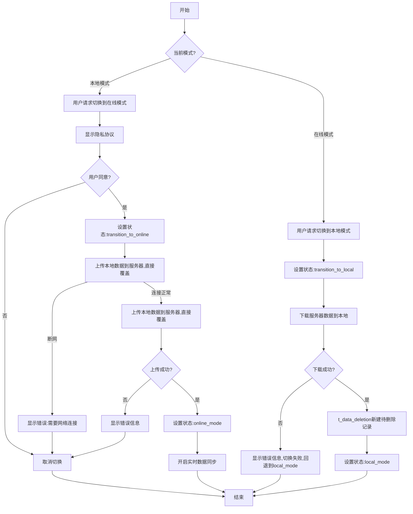

```mermaid

flowchart TD
    A[开始] --> B{当前模式?}
    
    B -->|本地模式| C[用户请求切换到在线模式]
    C --> F[显示隐私协议]
    F --> G{用户同意?}
    G -->|否| H[取消切换]
    H --> Z[结束]
    G -->|是| I[设置状态:transition_to_online]
    I --> J[上传本地数据到服务器,直接覆盖]
    J -->|断网| K[显示错误:需要网络连接]
    K --> H
    J -->|连接正常| O[上传本地数据到服务器,直接覆盖]
    O --> P{上传成功?}
    P -->|否| Q[显示错误信息]
    Q --> H
    P -->|是| R[设置状态:online_mode]
    R --> S[开启实时数据同步]
    S --> Z
    
    B -->|在线模式| T[用户请求切换到本地模式]
    T --> U[设置状态:transition_to_local]
    U --> X[下载服务器数据到本地]
    X --> Y{下载成功?}
    Y -->|否| AA2[显示错误信息,切换失败,回退到local_mode]
    AA2 --> Z
    Y -->|是| AB2[t_data_deletion新建待删除记录]

    AB2 -->AE[设置状态:local_mode]
    AE --> Z

```