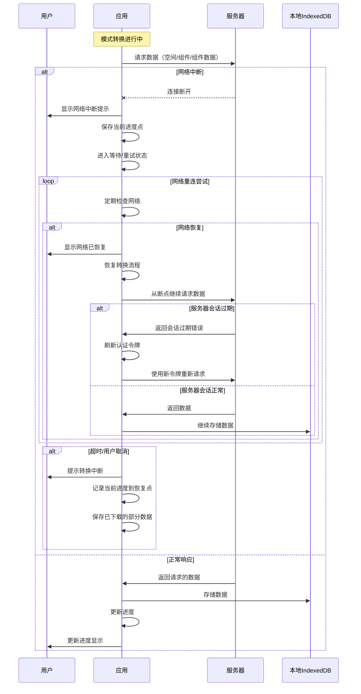

```mermaid
sequenceDiagram
    participant User as 用户
    participant App as 应用
    participant Server as 服务器
    participant IndexedDB as 本地IndexedDB
    
    Note over App: 模式转换进行中
    
    App->>Server: 请求数据（空间/组件/组件数据）
    
    alt 网络中断
        Server--x App: 连接断开
        App->>User: 显示网络中断提示
        App->>App: 保存当前进度点
        App->>App: 进入等待/重试状态
        
        loop 网络重连尝试
            App->>App: 定期检查网络
            alt 网络恢复
                App->>User: 显示网络已恢复
                App->>App: 恢复转换流程
                App->>Server: 从断点继续请求数据
                
                alt 服务器会话过期
                    Server->>App: 返回会话过期错误
                    App->>App: 刷新认证令牌
                    App->>Server: 使用新令牌重新请求
                else 服务器会话正常
                    Server->>App: 返回数据
                    App->>IndexedDB: 继续存储数据
                end
            end
        end
        
        alt 超时/用户取消
            App->>User: 提示转换中断
            App->>App: 记录当前进度到恢复点
            App->>App: 保存已下载的部分数据
        end
    else 正常响应
        Server->>App: 返回请求的数据
        App->>IndexedDB: 存储数据
        App->>App: 更新进度
        App->>User: 更新进度显示
    end
```