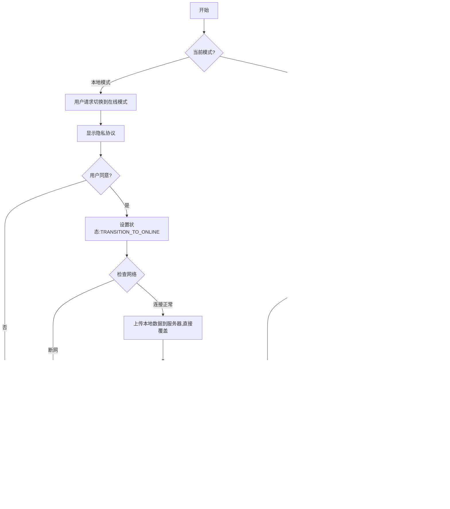

```mermaid

flowchart TD
    A[开始] --> B{当前模式?}
    
    B -->|本地模式| C[用户请求切换到在线模式]
    C --> F[显示隐私协议]
    F --> G{用户同意?}
    G -->|否| H[取消切换]
    H --> Z[结束]
    G -->|是| I[设置状态:TRANSITION_TO_ONLINE]
    I --> J{检查网络}
    J -->|断网| K[显示错误:需要网络连接]
    K --> H
    J -->|连接正常| O[上传本地数据到服务器,直接覆盖]
    O --> P{上传成功?}
    P -->|否| Q[显示错误信息]
    Q --> H
    P -->|是| R[设置状态:ONLINE_MODE]
    R --> S[开启实时数据同步]
    S --> Z
    
    B -->|在线模式| T[用户请求切换到本地模式]
    T --> U[设置状态:TRANSITION_TO_LOCAL]
    U --> X[下载服务器数据到本地]
    X --> Y{下载成功?}
    Y -->|否| AA2[显示错误信息]
    AA2 --> Z
    Y -->|是| AB2[待删除组件任务]
    AB2 --> AC2{清空成功?}
    AC2 -->|否| AD2[记录错误,稍后重试]
    AD2 --> Z
    AC2 -->|是| AE[设置状态:LOCAL_MODE]
    AE --> AF[关闭实时数据同步]
    AF --> Z

```