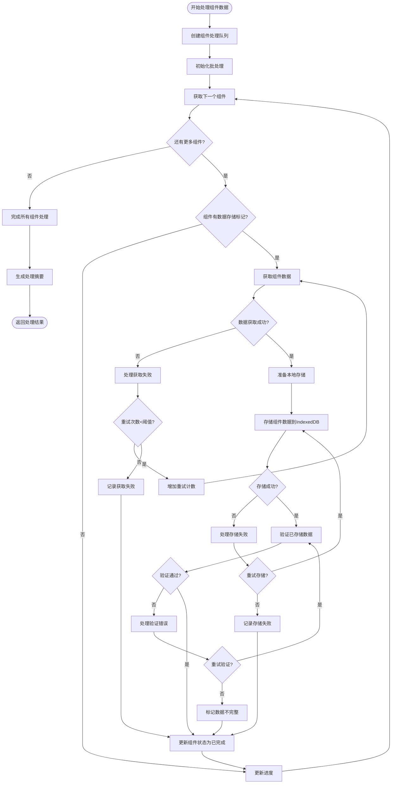

```mermaid
flowchart TD
    StartProcessing([开始处理组件数据]) --> CreateQueue[创建组件处理队列]
    
    CreateQueue --> InitBatchProcessing[初始化批处理]
    
    InitBatchProcessing --> GetNextComponent[获取下一个组件]
    GetNextComponent --> HasMoreComponents{还有更多组件?}
    
    HasMoreComponents -->|否| CompleteProcessing[完成所有组件处理]
    HasMoreComponents -->|是| CheckDataFlag{组件有数据存储标记?}
    
    CheckDataFlag -->|否| UpdateProgress[更新进度]
    CheckDataFlag -->|是| FetchComponentData[获取组件数据]
    
    FetchComponentData --> DataFetchOk{数据获取成功?}
    
    DataFetchOk -->|否| HandleFetchError[处理获取失败]
    HandleFetchError --> RetryCount{重试次数<阈值?}
    RetryCount -->|是| IncrementRetry[增加重试计数]
    IncrementRetry --> FetchComponentData
    RetryCount -->|否| LogFetchFailure[记录获取失败]
    
    DataFetchOk -->|是| PrepareStorage[准备本地存储]
    PrepareStorage --> StoreComponentData[存储组件数据到IndexedDB]
    
    StoreComponentData --> StorageOk{存储成功?}
    StorageOk -->|否| HandleStorageError[处理存储失败]
    HandleStorageError --> RetryStorage{重试存储?}
    RetryStorage -->|是| StoreComponentData
    RetryStorage -->|否| LogStorageFailure[记录存储失败]
    
    StorageOk -->|是| VerifyStoredData[验证已存储数据]
    VerifyStoredData --> VerifyOk{验证通过?}
    
    VerifyOk -->|否| HandleVerifyError[处理验证错误]
    HandleVerifyError --> RetryVerify{重试验证?}
    RetryVerify -->|是| VerifyStoredData
    RetryVerify -->|否| MarkDataIncomplete[标记数据不完整]
    
    VerifyOk -->|是| UpdateComponentStatus[更新组件状态为已完成]
    LogFetchFailure --> UpdateComponentStatus
    LogStorageFailure --> UpdateComponentStatus
    MarkDataIncomplete --> UpdateComponentStatus
    
    UpdateComponentStatus --> UpdateProgress
    UpdateProgress --> GetNextComponent
    
    CompleteProcessing --> GenerateSummary[生成处理摘要]
    GenerateSummary --> Return([返回处理结果])
```