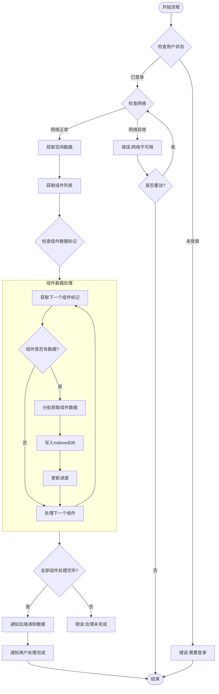

```mermaid
flowchart TD
    Start([开始流程]) --> CheckStatus{检查用户状态}
    CheckStatus -->|已登录| CheckNetwork{检查网络}
    CheckStatus -->|未登录| Error1[错误:需要登录]
    Error1 --> End([结束])
    
    CheckNetwork -->|网络正常| FetchSpaceData[获取空间数据]
    CheckNetwork -->|网络异常| Error2[错误:网络不可用]
    Error2 --> RetryCheck{是否重试?}
    RetryCheck -->|是| CheckNetwork
    RetryCheck -->|否| End
    
    FetchSpaceData --> FetchComponentList[获取组件列表]
    FetchComponentList --> CheckComponentData{检查组件数据标记}
    
    subgraph ComponentProcess [组件数据处理]
        direction TB
        A[获取下一个组件标记] --> B{组件是否有数据?}
        B -->|否| NextComponent[处理下一个组件]
        B -->|是| C[分批获取组件数据]
        C --> D[写入IndexedDB]
        D --> UpdateProgress[更新进度]
        UpdateProgress --> NextComponent
        NextComponent --> A
    end
    
    CheckComponentData --> ComponentProcess
    ComponentProcess --> AllComponentsProcessed{全部组件处理完毕?}
    
    AllComponentsProcessed -->|是| ClearServerData[通知后端清除数据]
    AllComponentsProcessed -->|否| Error3[错误:处理未完成]
    
    ClearServerData --> CompletionNotification[通知用户处理完成]
    CompletionNotification --> End
```