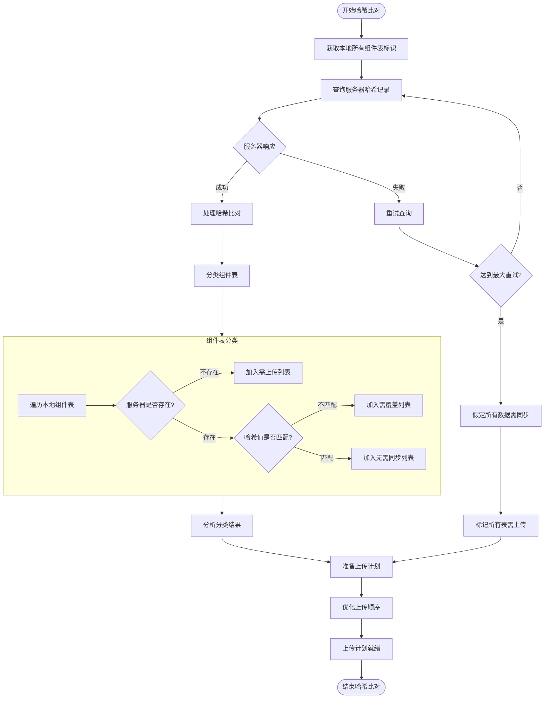

```mermaid
flowchart TD
    Start([开始哈希比对]) --> GetLocalTables[获取本地所有组件表标识]
    GetLocalTables --> QueryServer[查询服务器哈希记录]
    
    QueryServer --> ServerResponse{服务器响应}
    ServerResponse -->|成功| ProcessHashComparison[处理哈希比对]
    ServerResponse -->|失败| RetryServer[重试查询]
    
    RetryServer --> MaxRetries{达到最大重试?}
    MaxRetries -->|否| QueryServer
    MaxRetries -->|是| AssumeAllNew[假定所有数据需同步]
    
    ProcessHashComparison --> CategorizeResults[分类组件表]
    
    subgraph Categorization [组件表分类]
        C1[遍历本地组件表] --> C2{服务器是否存在?}
        C2 -->|不存在| C3[加入需上传列表]
        C2 -->|存在| C4{哈希值是否匹配?}
        C4 -->|不匹配| C5[加入需覆盖列表]
        C4 -->|匹配| C6[加入无需同步列表]
    end
    
    CategorizeResults --> Categorization
    AssumeAllNew --> FlagAllForUpload[标记所有表需上传]
    
    Categorization --> AnalyzeResults[分析分类结果]
    FlagAllForUpload --> PrepareUploadPlan[准备上传计划]
    
    AnalyzeResults --> PrepareUploadPlan
    PrepareUploadPlan --> OptimizeOrder[优化上传顺序]
    
    OptimizeOrder --> PlanReady[上传计划就绪]
    PlanReady --> End([结束哈希比对])
```