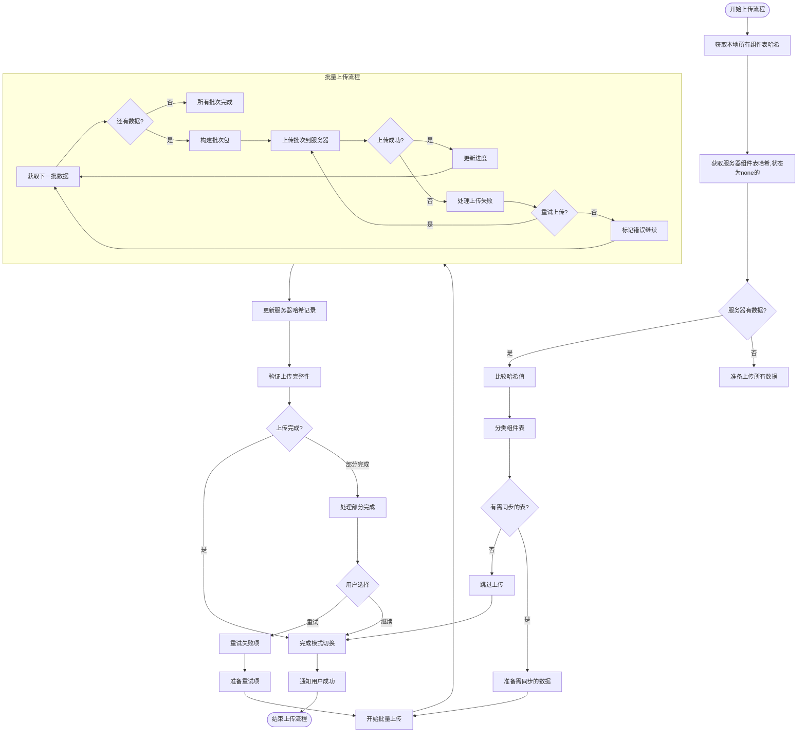

```mermaid
flowchart TD
    Start([开始上传流程]) --> CollectLocalHashes[获取本地所有组件表哈希]
    CollectLocalHashes --> FetchServerHashes[获取服务器组件表哈希,状态为none的]
    
    FetchServerHashes --> ServerHasData{服务器有数据?}
    
    ServerHasData -->|是| CompareHashes[比较哈希值]
    ServerHasData -->|否| ClassifyTables2[准备上传所有数据]
    
    CompareHashes --> ClassifyTables[分类组件表]
    ClassifyTables --> HasChanges{有需同步的表?}
    
    HasChanges -->|否| SkipUpload[跳过上传]
    HasChanges -->|是| PrepareChangedData[准备需同步的数据]
    
    
    PrepareChangedData --> StartBatching[开始批量上传]
    
    subgraph BatchUpload [批量上传流程]
        B1[获取下一批数据] --> B2{还有数据?}
        B2 -->|否| BatchesComplete[所有批次完成]
        B2 -->|是| B3[构建批次包]
        B3 --> B4[上传批次到服务器]
        B4 --> B5{上传成功?}
        B5 -->|是| B6[更新进度]
        B5 -->|否| B7[处理上传失败]
        B7 --> B8{重试上传?}
        B8 -->|是| B4
        B8 -->|否| B9[标记错误继续]
        B6 --> B1
        B9 --> B1
    end
    
    StartBatching --> BatchUpload
    
    BatchUpload --> UpdateServerHashes[更新服务器哈希记录]
    UpdateServerHashes --> VerifyUpload[验证上传完整性]
    
    VerifyUpload --> UploadComplete{上传完成?}
    UploadComplete -->|是| FinalizeMode[完成模式切换]
    UploadComplete -->|部分完成| HandlePartial[处理部分完成]
    
    HandlePartial --> UserChoice{用户选择}
    UserChoice -->|重试| RetryFailed[重试失败项]
    UserChoice -->|继续| FinalizeMode
    
    RetryFailed --> PrepareRetry[准备重试项]
    PrepareRetry --> StartBatching
    
    FinalizeMode --> NotifySuccess[通知用户成功]
    NotifySuccess --> End([结束上传流程])
    
    SkipUpload --> FinalizeMode
```