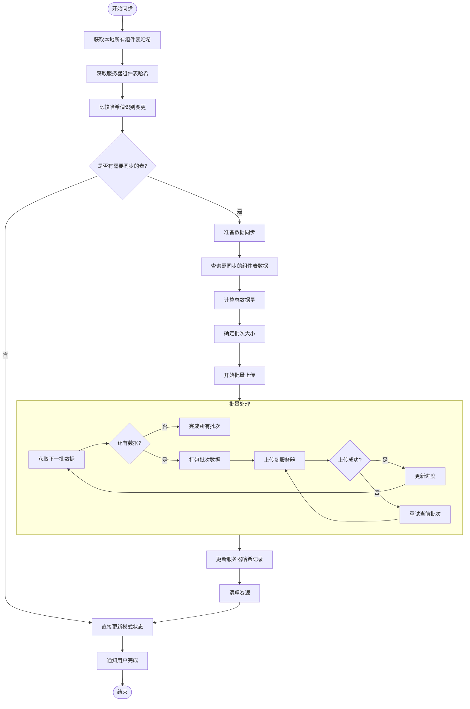

```mermaid
flowchart TD
    Start([开始同步]) --> FetchLocalHashes[获取本地所有组件表哈希]
    FetchLocalHashes --> FetchServerHashes[获取服务器组件表哈希]
    FetchServerHashes --> CompareHashes[比较哈希值识别变更]
    
    CompareHashes --> NeedSync{是否有需要同步的表?}
    NeedSync -->|否| UpdateMode[直接更新模式状态]
    NeedSync -->|是| PrepareSync[准备数据同步]
    
    PrepareSync --> QueryChangedData[查询需同步的组件表数据]
    QueryChangedData --> CalculateDataSize[计算总数据量]
    CalculateDataSize --> DetermineBatchSize[确定批次大小]
    
    DetermineBatchSize --> BeginBatchUpload[开始批量上传]
    
    subgraph BatchProcess [批量处理]
        A[获取下一批数据] --> B{还有数据?}
        B -->|否| ExitLoop[完成所有批次]
        B -->|是| C[打包批次数据]
        C --> D[上传到服务器]
        D --> E{上传成功?}
        E -->|是| F[更新进度]
        E -->|否| G[重试当前批次]
        G --> D
        F --> A
    end
    
    BeginBatchUpload --> BatchProcess
    BatchProcess --> UpdateHashes[更新服务器哈希记录]
    UpdateHashes --> CleanupResources[清理资源]
    CleanupResources --> UpdateMode
    
    UpdateMode --> NotifyCompletion[通知用户完成]
    NotifyCompletion --> End([结束])
```