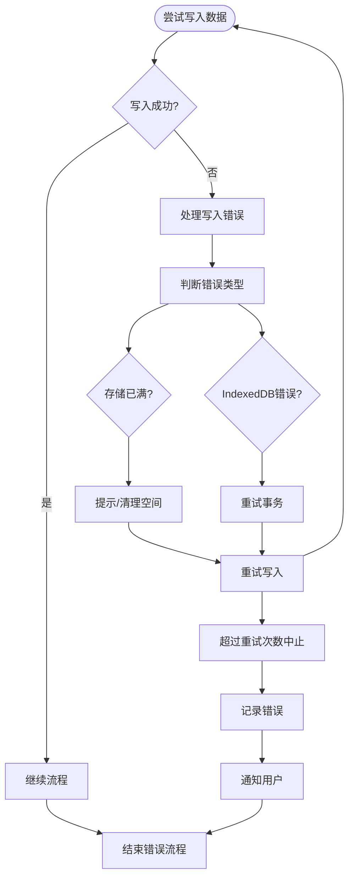

```mermaid
flowchart TD
    WriteAttempt([尝试写入数据]) --> CheckWriteResult{写入成功?}
    
    CheckWriteResult -->|是| ContinueProcess[继续流程]
    
    CheckWriteResult -->|否| HandleWriteError[处理写入错误]
    HandleWriteError --> DetermineErrorType[判断错误类型]
    
    DetermineErrorType --> StorageFull{存储已满?}
    DetermineErrorType --> IndexedDBError{IndexedDB错误?}
    
    StorageFull --> FreeSpace[提示/清理空间]
    FreeSpace --> RetryWrite[重试写入]
    
    IndexedDBError --> RetryTransaction[重试事务]
    RetryTransaction --> RetryWrite
    
    RetryWrite --> WriteAttempt
    RetryWrite --> AbortOnFailure[超过重试次数中止]
    
    AbortOnFailure --> LogError[记录错误]
    LogError --> UserNotification[通知用户]
    UserNotification --> EndErrorProcess[结束错误流程]
    
    ContinueProcess --> EndErrorProcess
```