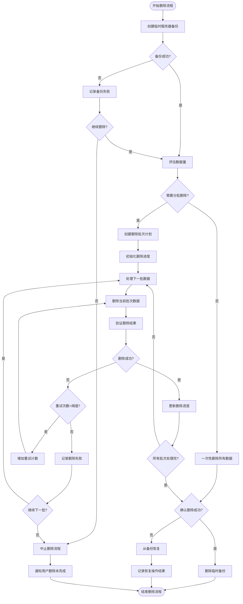

```mermaid
flowchart TD
    Start([开始删除流程]) --> CreateBackup[创建临时服务器备份]
    CreateBackup --> BackupOK{备份成功?}
    BackupOK -->|否| LogBackupFail[记录备份失败]
    BackupOK -->|是| EstimateSize[评估数据量]
    
    LogBackupFail --> Proceed{继续删除?}
    Proceed -->|否| Abort[中止删除流程]
    Proceed -->|是| EstimateSize
    
    EstimateSize --> ShouldChunk{需要分批删除?}
    ShouldChunk -->|否| DeleteAll[一次性删除所有数据]
    ShouldChunk -->|是| CreateChunks[创建删除批次计划]
    
    CreateChunks --> InitDeleteProgress[初始化删除进度]
    InitDeleteProgress --> NextChunk[处理下一批数据]
    
    DeleteAll --> ConfirmDelete{确认删除成功?}
    NextChunk --> DeleteChunk[删除当前批次数据]
    DeleteChunk --> VerifyDeletion[验证删除结果]
    
    VerifyDeletion --> DeleteResult{删除成功?}
    DeleteResult -->|是| UpdateProgress[更新删除进度]
    DeleteResult -->|否| RetryDelete{重试次数<阈值?}
    
    RetryDelete -->|是| IncrementRetry[增加重试计数]
    RetryDelete -->|否| LogFailure[记录删除失败]
    
    IncrementRetry --> DeleteChunk
    LogFailure --> ContinueNext{继续下一批?}
    
    UpdateProgress --> AllChunksProcessed{所有批次处理完?}
    AllChunksProcessed -->|否| NextChunk
    AllChunksProcessed -->|是| ConfirmDelete
    
    ContinueNext -->|是| NextChunk
    ContinueNext -->|否| Abort
    
    ConfirmDelete -->|是| RemoveBackup[删除临时备份]
    ConfirmDelete -->|否| RestoreFromBackup[从备份恢复]
    
    RemoveBackup --> End([结束删除流程])
    RestoreFromBackup --> LogRestoreResult[记录恢复操作结果]
    LogRestoreResult --> End
    
    Abort --> NotifyUser[通知用户删除未完成]
    NotifyUser --> End
```