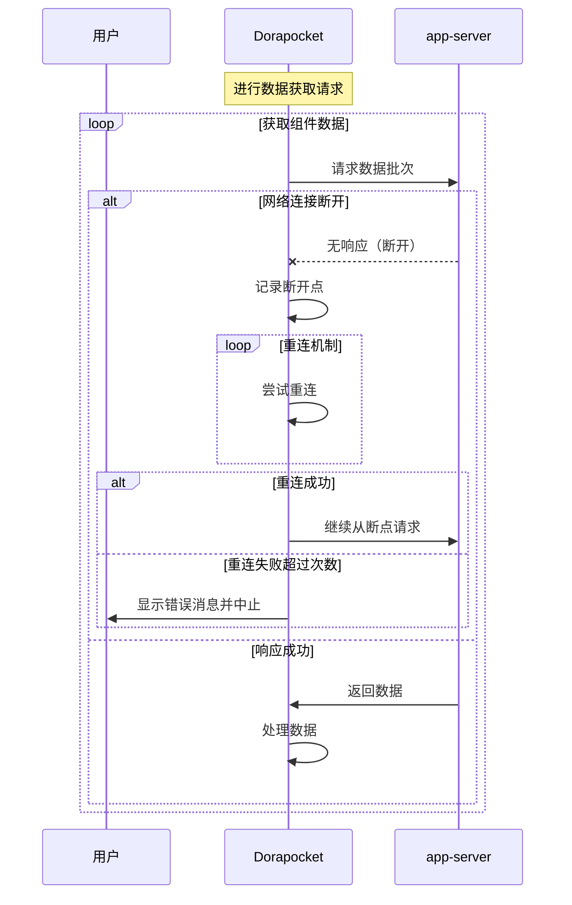

```mermaid
sequenceDiagram
    participant User as 用户
    participant App as Dorapocket
    participant Server as app-server
    
    Note over App: 进行数据获取请求
    
    loop 获取组件数据
        App->>Server: 请求数据批次
        
        alt 网络连接断开
            Server--xApp: 无响应（断开）
            App->>App: 记录断开点
            
            loop 重连机制
                App->>App: 尝试重连
            end
            
            alt 重连成功
                App->>Server: 继续从断点请求
            else 重连失败超过次数
                App->>User: 显示错误消息并中止
                
            end
        else 响应成功
            Server->>App: 返回数据
            App->>App: 处理数据
        end
    end
```