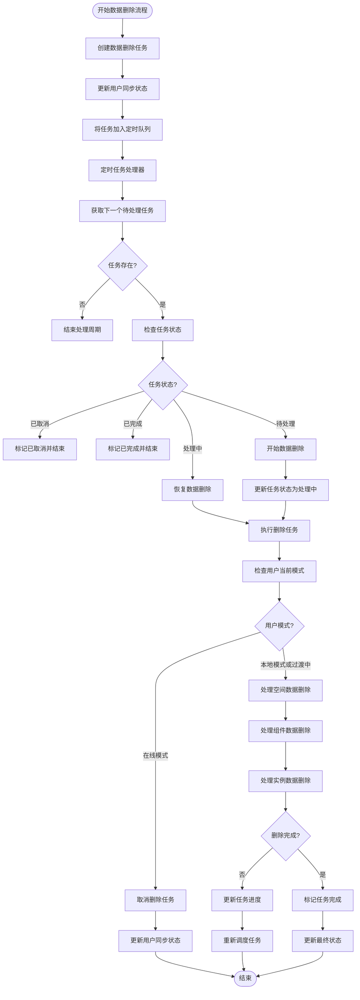

```mermaid
flowchart TD
    Start([开始数据删除流程]) --> CreateDeletionTask[创建数据删除任务]
    CreateDeletionTask --> UpdateUserSyncState[更新用户同步状态]
    UpdateUserSyncState --> ScheduleTask[将任务加入定时队列]
    
    ScheduleTask --> DeletionTaskProcessor[定时任务处理器]
    DeletionTaskProcessor --> GetNextTask[获取下一个待处理任务]
    GetNextTask --> TaskExists{任务存在?}
    
    TaskExists -->|否| EndProcessor[结束处理周期]
    TaskExists -->|是| CheckTaskStatus[检查任务状态]
    
    CheckTaskStatus --> StatusCheck{任务状态?}
    StatusCheck -->|已取消| MarkCancelled[标记已取消并结束]
    StatusCheck -->|已完成| MarkCompleted[标记已完成并结束]
    StatusCheck -->|待处理| StartDeletion[开始数据删除]
    StatusCheck -->|处理中| ResumeDeletion[恢复数据删除]
    
    StartDeletion --> UpdateTaskStatus[更新任务状态为处理中]
    ResumeDeletion --> DeletionTask[执行删除任务]
    UpdateTaskStatus --> DeletionTask
    
    DeletionTask --> CheckUserMode[检查用户当前模式]
    CheckUserMode --> UserModeCheck{用户模式?}
    
    UserModeCheck -->|在线模式| CancelDeletion[取消删除任务]
    CancelDeletion --> UpdateUserState[更新用户同步状态]
    UpdateUserState --> End
    
    UserModeCheck -->|本地模式或过渡中| ProcessSpaces[处理空间数据删除]
    ProcessSpaces --> ProcessComponents[处理组件数据删除]
    ProcessComponents --> ProcessInstances[处理实例数据删除]
    
    ProcessInstances --> CompletionCheck{删除完成?}
    CompletionCheck -->|是| MarkTaskCompleted[标记任务完成]
    CompletionCheck -->|否| UpdateProgress[更新任务进度]
    
    UpdateProgress --> ReScheduleTask[重新调度任务]
    ReScheduleTask --> End([结束])
    
    MarkTaskCompleted --> UpdateFinalState[更新最终状态]
    UpdateFinalState --> End
```