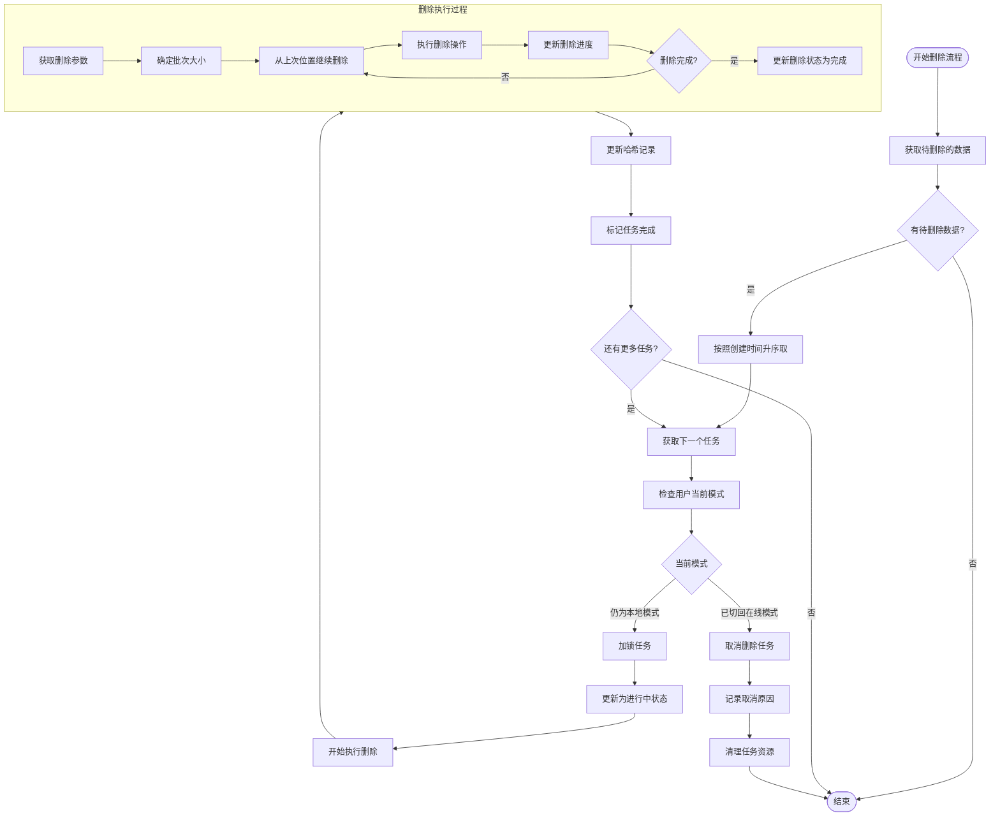

```mermaid
flowchart TD
    Start([开始删除流程]) --> FetchTasks[获取待删除的数据]
    FetchTasks --> HasTasks{有待删除数据?}
    
    HasTasks -->|否| End([结束])
    HasTasks -->|是| PrioritizeTasks[按照创建时间升序取]
    
    PrioritizeTasks --> GetNextTask[获取下一个任务]
    GetNextTask --> CheckUserMode[检查用户当前模式]
    
    CheckUserMode --> CurrentMode{当前模式}
    CurrentMode -->|已切回在线模式| TaskCancel[取消删除任务]
    CurrentMode -->|仍为本地模式| LockTask[加锁任务]
    
    LockTask --> UpdateStatus[更新为进行中状态]
    UpdateStatus --> BeginDeletion[开始执行删除]
    
    subgraph DeletionProcess [删除执行过程]
        A[获取删除参数] --> B[确定批次大小]
        B --> C[从上次位置继续删除]
        C --> D[执行删除操作]
        D --> E[更新删除进度]
        E --> F{删除完成?}
        F -->|否| C
        F -->|是| G[更新删除状态为完成]
    end
    
    BeginDeletion --> DeletionProcess
    
    DeletionProcess --> UpdateHashRecord[更新哈希记录]
    UpdateHashRecord --> MarkCompleted[标记任务完成]
    
    TaskCancel --> LogCancellation[记录取消原因]
    LogCancellation --> CleanupTask[清理任务资源]
    
    MarkCompleted --> CheckMoreTasks{还有更多任务?}
    CheckMoreTasks -->|是| GetNextTask
    CheckMoreTasks -->|否| End
    
    CleanupTask --> End
```