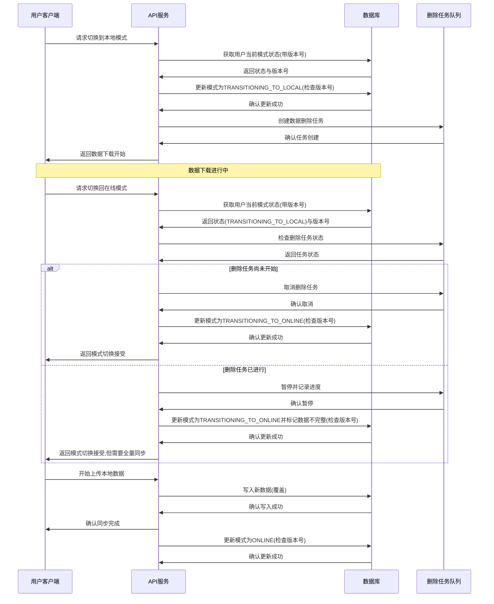

```mermaid
sequenceDiagram
    participant User as 用户客户端
    participant API as API服务
    participant DB as 数据库
    participant Task as 删除任务队列
    
    User->>API: 请求切换到本地模式
    API->>DB: 获取用户当前模式状态(带版本号)
    DB->>API: 返回状态与版本号
    
    API->>DB: 更新模式为TRANSITIONING_TO_LOCAL(检查版本号)
    DB->>API: 确认更新成功
    
    API->>Task: 创建数据删除任务
    Task->>API: 确认任务创建
    
    API->>User: 返回数据下载开始
    
    Note over User,DB: 数据下载进行中
    
    User->>API: 请求切换回在线模式
    
    API->>DB: 获取用户当前模式状态(带版本号)
    DB->>API: 返回状态(TRANSITIONING_TO_LOCAL)与版本号
    
    API->>Task: 检查删除任务状态
    Task->>API: 返回任务状态
    
    alt 删除任务尚未开始
        API->>Task: 取消删除任务
        Task->>API: 确认取消
        API->>DB: 更新模式为TRANSITIONING_TO_ONLINE(检查版本号)
        DB->>API: 确认更新成功
        API->>User: 返回模式切换接受
    else 删除任务已进行
        API->>Task: 暂停并记录进度
        Task->>API: 确认暂停
        API->>DB: 更新模式为TRANSITIONING_TO_ONLINE并标记数据不完整(检查版本号)
        DB->>API: 确认更新成功
        API->>User: 返回模式切换接受,但需要全量同步
    end
    
    User->>API: 开始上传本地数据
    API->>DB: 写入新数据(覆盖)
    DB->>API: 确认写入成功
    API->>User: 确认同步完成
    
    API->>DB: 更新模式为ONLINE(检查版本号)
    DB->>API: 确认更新成功
```