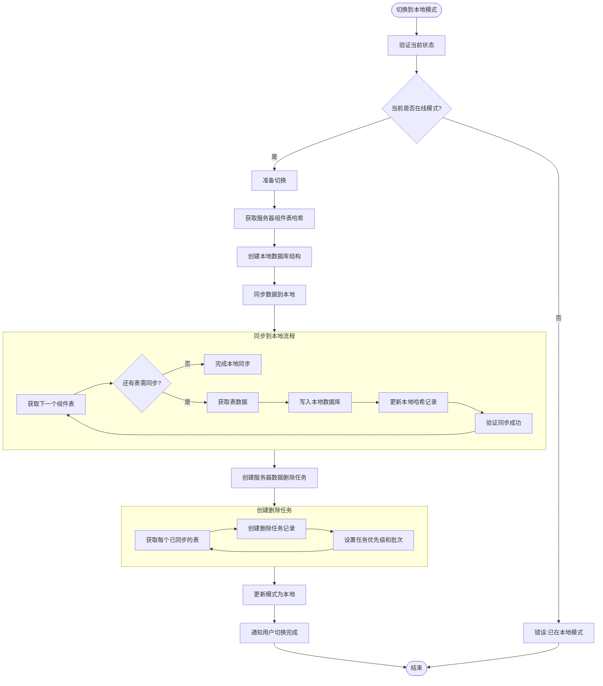

```mermaid
flowchart TD
    Start([切换到本地模式]) --> ValidateState[验证当前状态]
    ValidateState --> CurrentMode{当前是否在线模式?}
    
    CurrentMode -->|否| ErrorMode[错误:已在本地模式]
    CurrentMode -->|是| PrepareTransition[准备切换]
    
    PrepareTransition --> A[获取服务器组件表哈希]
    A --> B[创建本地数据库结构]
    B --> SyncToLocal[同步数据到本地]
    
    subgraph SyncProcess [同步到本地流程]
        C[获取下一个组件表] --> D{还有表需同步?}
        D -->|否| CompleteLocalSync[完成本地同步]
        D -->|是| E[获取表数据]
        E --> F[写入本地数据库]
        F --> G[更新本地哈希记录]
        G --> H[验证同步成功]
        H --> C
    end
    
    SyncToLocal --> SyncProcess
    
    SyncProcess --> CreateDeletionTasks[创建服务器数据删除任务]
    
    subgraph DeletionTasks [创建删除任务]
        I[获取每个已同步的表] --> J[创建删除任务记录]
        J --> K[设置任务优先级和批次]
        K --> I
    end
    
    CreateDeletionTasks --> DeletionTasks
    DeletionTasks --> UpdateModeLocal[更新模式为本地]
    UpdateModeLocal --> NotifyUserComplete[通知用户切换完成]
    
    NotifyUserComplete --> End([结束])
    ErrorMode --> End
```