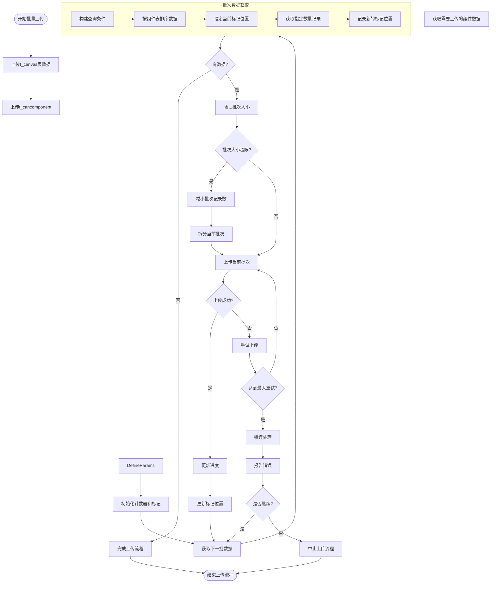

```mermaid
flowchart TD
    Start([开始批量上传]) --> UploadSpaceData[上传t_canvas表数据]
    UploadSpaceData --> UploadComponentListData[上传t_cancomponent]
    
    UploadData[获取需要上传的组件数据]
    DefineParams --> InitCounters[初始化计数器和标记]
    
    InitCounters --> FetchNextBatch[获取下一批数据]
    
    subgraph BatchFetch [批次数据获取]
        A[构建查询条件] --> B[按组件表排序数据]
        B --> C[设定当前标记位置]
        C --> D[获取指定数量记录]
        D --> E[记录新的标记位置]
    end
    
    FetchNextBatch --> BatchFetch
    
    BatchFetch --> CheckResults{有数据?}
    CheckResults -->|否| CompleteUpload[完成上传流程]
    CheckResults -->|是| ValidateBatch[验证批次大小]
    
    ValidateBatch --> SizeTooLarge{批次大小超限?}
    SizeTooLarge -->|是| AdjustBatchSize[减小批次记录数]
    SizeTooLarge -->|否| UploadBatch[上传当前批次]
    
    AdjustBatchSize --> SplitBatch[拆分当前批次]
    SplitBatch --> UploadBatch
    
    UploadBatch --> UploadSuccess{上传成功?}
    UploadSuccess -->|是| UpdateProgress[更新进度]
    UploadSuccess -->|否| RetryUpload[重试上传]
    
    RetryUpload --> MaxRetries{达到最大重试?}
    MaxRetries -->|否| UploadBatch
    MaxRetries -->|是| ErrorHandling[错误处理]
    
    ErrorHandling --> ReportError[报告错误]
    ReportError --> ContinueOption{是否继续?}
    ContinueOption -->|是| FetchNextBatch
    ContinueOption -->|否| AbortProcess[中止上传流程]
    
    UpdateProgress --> UpdateMarker[更新标记位置]
    UpdateMarker --> FetchNextBatch
    
    CompleteUpload --> End([结束上传流程])
    AbortProcess --> End
```