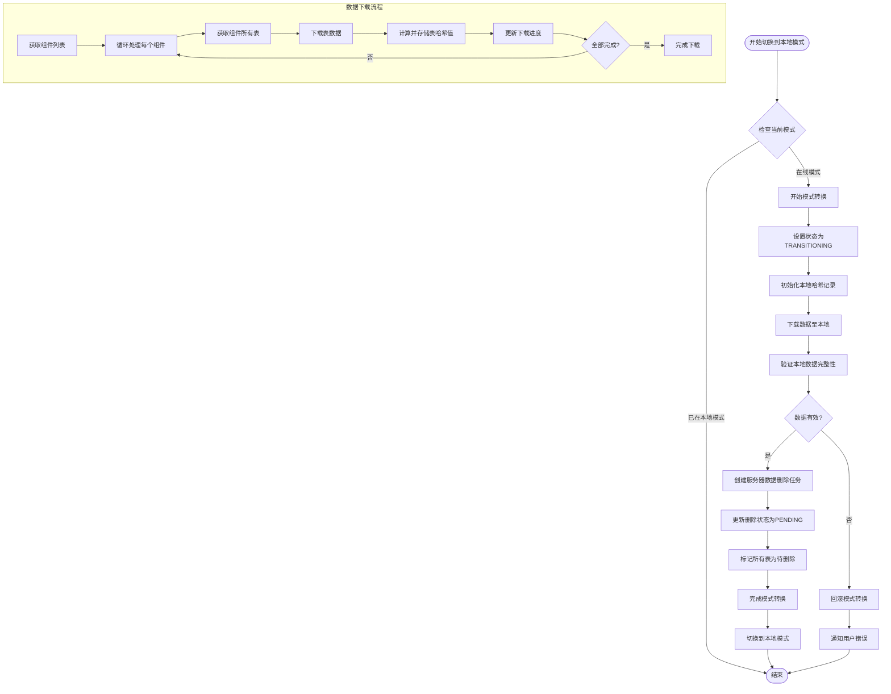

```mermaid
flowchart TD
    Start([开始切换到本地模式]) --> CheckCurrentMode{检查当前模式}
    CheckCurrentMode -->|已在本地模式| End([结束])
    CheckCurrentMode -->|在线模式| BeginTransition[开始模式转换]
    
    BeginTransition --> UpdateModeState[设置状态为TRANSITIONING]
    UpdateModeState --> InitLocalHashes[初始化本地哈希记录]
    
    InitLocalHashes --> DownloadData[下载数据至本地]
    
    subgraph DownloadProcess [数据下载流程]
        A[获取组件列表] --> B[循环处理每个组件]
        B --> C[获取组件所有表]
        C --> D[下载表数据]
        D --> E[计算并存储表哈希值]
        E --> F[更新下载进度]
        F --> G{全部完成?}
        G -->|否| B
        G -->|是| H[完成下载]
    end
    
    DownloadData --> VerifyLocalData[验证本地数据完整性]
    VerifyLocalData --> DataValid{数据有效?}
    
    DataValid -->|是| CreateDeletionTask[创建服务器数据删除任务]
    DataValid -->|否| RollbackTransition[回滚模式转换]
    
    CreateDeletionTask --> UpdateDeletionStatus[更新删除状态为PENDING]
    UpdateDeletionStatus --> MarkTablesForDeletion[标记所有表为待删除]
    
    MarkTablesForDeletion --> CompleteTransition[完成模式转换]
    CompleteTransition --> SwitchToLocalMode[切换到本地模式]
    SwitchToLocalMode --> End
    
    RollbackTransition --> NotifyError[通知用户错误]
    NotifyError --> End
```