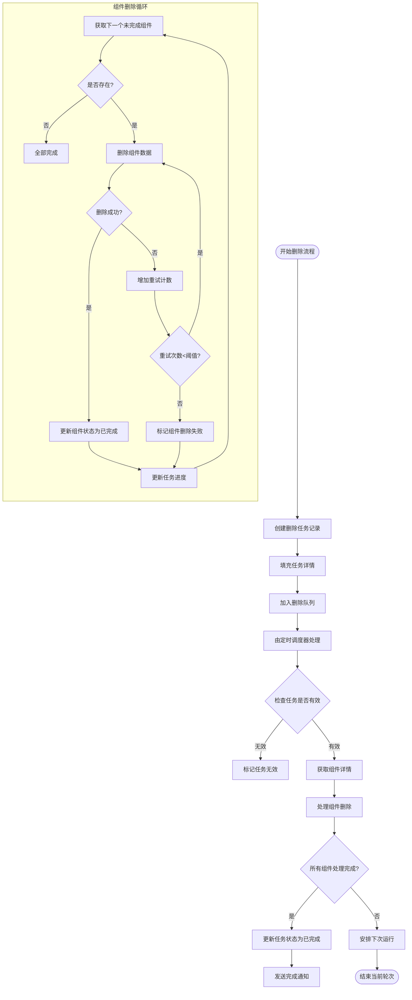

```mermaid
flowchart TD
    Start([开始删除流程]) --> CreateDeletionTask[创建删除任务记录]
    CreateDeletionTask --> PopulateTaskDetails[填充任务详情]
    PopulateTaskDetails --> QueueForDeletion[加入删除队列]
    
    QueueForDeletion --> ProcessByScheduler[由定时调度器处理]
    
    ProcessByScheduler --> CheckTaskValidity{检查任务是否有效}
    CheckTaskValidity -->|无效| MarkInvalid[标记任务无效]
    CheckTaskValidity -->|有效| FetchComponents[获取组件详情]
    
    FetchComponents --> ProcessComponents[处理组件删除]
    
    subgraph ComponentDeletion [组件删除循环]
        direction TB
        PC1[获取下一个未完成组件] --> PC2{是否存在?}
        PC2 -->|否| AllComplete[全部完成]
        PC2 -->|是| PC3[删除组件数据]
        PC3 --> PC4{删除成功?}
        PC4 -->|是| PC5[更新组件状态为已完成]
        PC4 -->|否| PC6[增加重试计数]
        PC6 --> PC7{重试次数<阈值?}
        PC7 -->|是| PC3
        PC7 -->|否| PC8[标记组件删除失败]
        PC5 --> PC9[更新任务进度]
        PC8 --> PC9
        PC9 --> PC1
    end
    
    ProcessComponents --> CheckCompletion{所有组件处理完成?}
    CheckCompletion -->|是| UpdateTaskStatus[更新任务状态为已完成]
    CheckCompletion -->|否| ScheduleNextRun[安排下次运行]
    
    UpdateTaskStatus --> SendNotification[发送完成通知]
    ScheduleNextRun --> End([结束当前轮次])
```