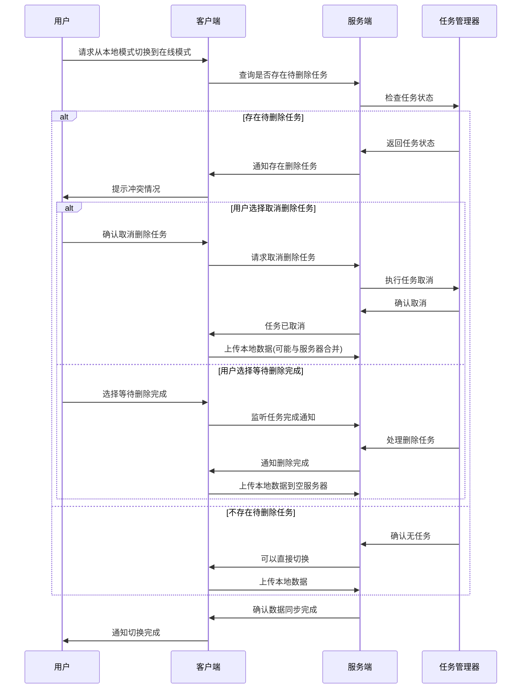

```mermaid
sequenceDiagram
    participant User as 用户
    participant Client as 客户端
    participant Server as 服务端
    participant TaskManager as 任务管理器
    
    User->>Client: 请求从本地模式切换到在线模式
    Client->>Server: 查询是否存在待删除任务
    Server->>TaskManager: 检查任务状态
    
    alt 存在待删除任务
        TaskManager->>Server: 返回任务状态
        Server->>Client: 通知存在删除任务
        Client->>User: 提示冲突情况
        
        alt 用户选择取消删除任务
            User->>Client: 确认取消删除任务
            Client->>Server: 请求取消删除任务
            Server->>TaskManager: 执行任务取消
            TaskManager->>Server: 确认取消
            
            Server->>Client: 任务已取消
            Client->>Server: 上传本地数据(可能与服务器合并)
        else 用户选择等待删除完成
            User->>Client: 选择等待删除完成
            Client->>Server: 监听任务完成通知
            
            TaskManager->>Server: 处理删除任务
            Server->>Client: 通知删除完成
            Client->>Server: 上传本地数据到空服务器
        end
    else 不存在待删除任务
        TaskManager->>Server: 确认无任务
        Server->>Client: 可以直接切换
        Client->>Server: 上传本地数据
    end
    
    Server->>Client: 确认数据同步完成
    Client->>User: 通知切换完成
```