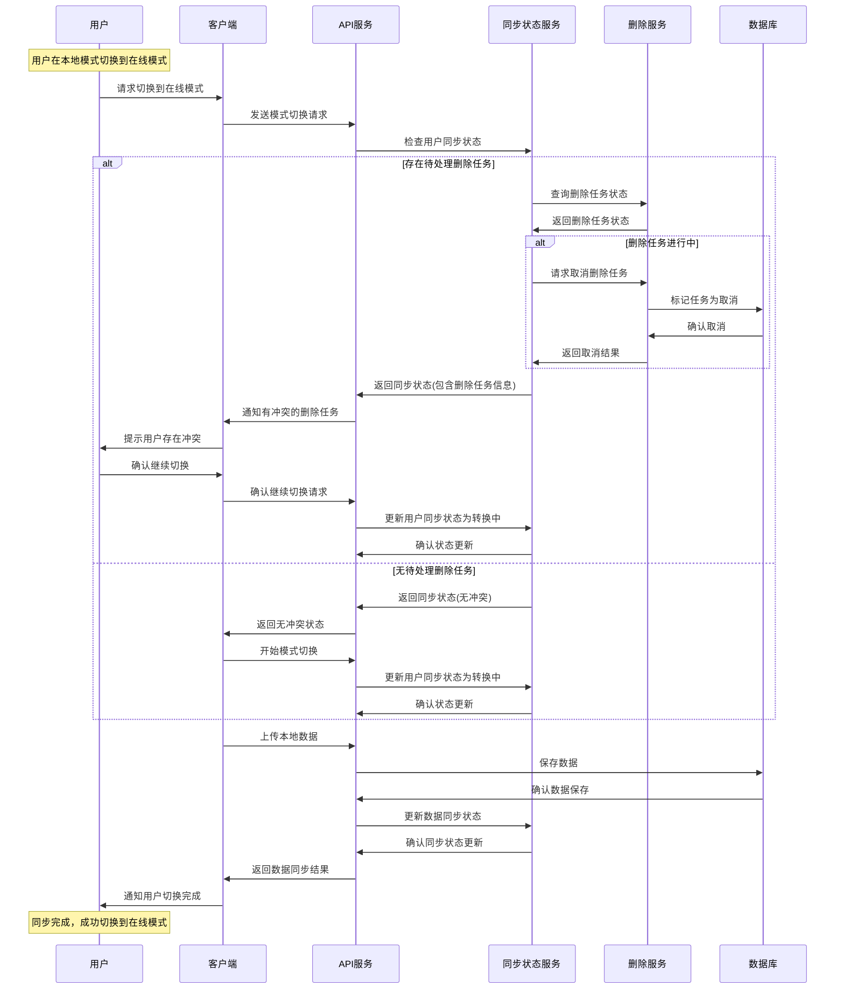

```mermaid
sequenceDiagram
    participant User as 用户
    participant Client as 客户端
    participant API as API服务
    participant SyncState as 同步状态服务
    participant DeletionService as 删除服务
    participant DB as 数据库
    
    Note over User: 用户在本地模式切换到在线模式
    User->>Client: 请求切换到在线模式
    Client->>API: 发送模式切换请求
    API->>SyncState: 检查用户同步状态
    
    alt 存在待处理删除任务
        SyncState->>DeletionService: 查询删除任务状态
        DeletionService->>SyncState: 返回删除任务状态
        
        alt 删除任务进行中
            SyncState->>DeletionService: 请求取消删除任务
            DeletionService->>DB: 标记任务为取消
            DB->>DeletionService: 确认取消
            DeletionService->>SyncState: 返回取消结果
        end
        
        SyncState->>API: 返回同步状态(包含删除任务信息)
        API->>Client: 通知有冲突的删除任务
        
        Client->>User: 提示用户存在冲突
        User->>Client: 确认继续切换
        
        Client->>API: 确认继续切换请求
        API->>SyncState: 更新用户同步状态为转换中
        SyncState->>API: 确认状态更新
    else 无待处理删除任务
        SyncState->>API: 返回同步状态(无冲突)
        API->>Client: 返回无冲突状态
        Client->>API: 开始模式切换
        API->>SyncState: 更新用户同步状态为转换中
        SyncState->>API: 确认状态更新
    end
    
    Client->>API: 上传本地数据
    API->>DB: 保存数据
    DB->>API: 确认数据保存
    API->>SyncState: 更新数据同步状态
    SyncState->>API: 确认同步状态更新
    
    API->>Client: 返回数据同步结果
    Client->>User: 通知用户切换完成
    
    Note over User: 同步完成，成功切换到在线模式
```