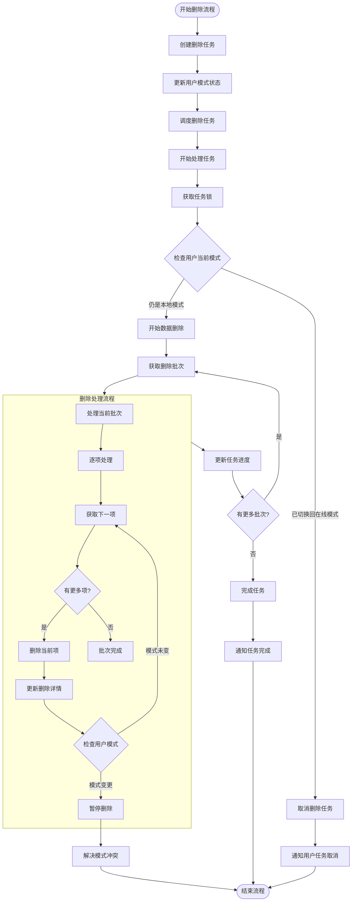

```mermaid
flowchart TD
    Start([开始删除流程]) --> CreateTask[创建删除任务]
    CreateTask --> UpdateUserStatus[更新用户模式状态]
    UpdateUserStatus --> ScheduleTask[调度删除任务]
    
    ScheduleTask --> ProcessTask[开始处理任务]
    ProcessTask --> LockTask[获取任务锁]
    
    LockTask --> CheckUserMode{检查用户当前模式}
    CheckUserMode -->|仍是本地模式| StartDeletion[开始数据删除]
    CheckUserMode -->|已切换回在线模式| CancelTask[取消删除任务]
    
    StartDeletion --> GetDeletionBatch[获取删除批次]
    
    subgraph DeletionProcess [删除处理流程]
        direction TB
        ProcessBatch[处理当前批次] --> ItemLoop[逐项处理]
        
        ItemLoop --> NextItem[获取下一项]
        NextItem --> HasItem{有更多项?}
        HasItem -->|是| DeleteItem[删除当前项]
        HasItem -->|否| BatchComplete[批次完成]
        
        DeleteItem --> UpdateDetail[更新删除详情]
        UpdateDetail --> CheckMode{检查用户模式}
        CheckMode -->|模式变更| PauseDeletion[暂停删除]
        CheckMode -->|模式未变| NextItem
    end
    
    GetDeletionBatch --> DeletionProcess
    DeletionProcess --> UpdateProgress[更新任务进度]
    
    UpdateProgress --> CheckMoreBatches{有更多批次?}
    CheckMoreBatches -->|是| GetDeletionBatch
    CheckMoreBatches -->|否| FinalizeTask[完成任务]
    
    PauseDeletion --> ResolveConflict[解决模式冲突]
    ResolveConflict --> End([结束流程])
    
    CancelTask --> NotifyUser[通知用户任务取消]
    NotifyUser --> End
    
    FinalizeTask --> NotifyCompletion[通知任务完成]
    NotifyCompletion --> End
```