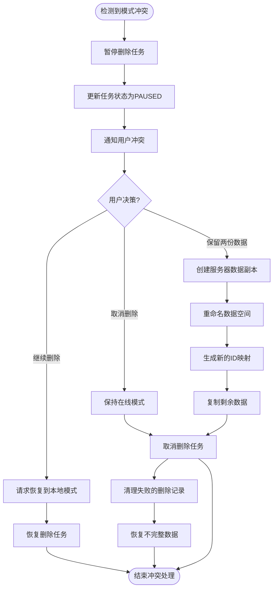

```mermaid
flowchart TD
    Start([检测到模式冲突]) --> PauseDeletion[暂停删除任务]
    PauseDeletion --> UpdateTaskStatus[更新任务状态为PAUSED]
    UpdateTaskStatus --> NotifyUser[通知用户冲突]
    
    NotifyUser --> GetUserDecision{用户决策?}
    GetUserDecision -->|继续删除| RevertToLocal[请求恢复到本地模式]
    GetUserDecision -->|取消删除| StayOnline[保持在线模式]
    GetUserDecision -->|保留两份数据| CreateCopy[创建服务器数据副本]
    
    RevertToLocal --> ResumeTask[恢复删除任务]
    ResumeTask --> End([结束冲突处理])
    
    StayOnline --> CancelTask[取消删除任务]
    CancelTask --> CleanupFailedDeletions[清理失败的删除记录]
    CleanupFailedDeletions --> RestoreIncomplete[恢复不完整数据]
    RestoreIncomplete --> End
    
    CreateCopy --> RenameDataspace[重命名数据空间]
    RenameDataspace --> GenerateNewIDs[生成新的ID映射]
    GenerateNewIDs --> CopyRemainingData[复制剩余数据]
    CopyRemainingData --> CancelTask
    CancelTask --> End
```