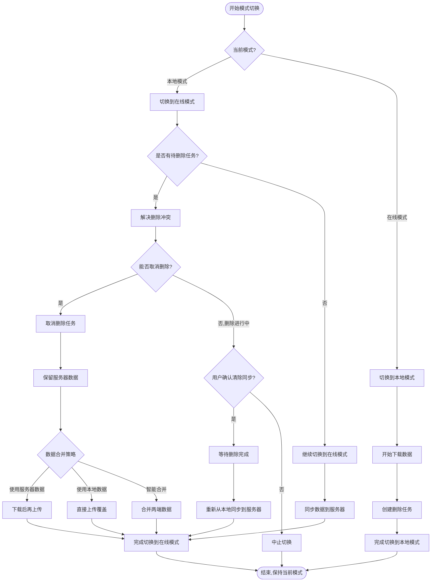

```mermaid
flowchart TD
    StartSwitch([开始模式切换]) --> CheckCurrentMode{当前模式?}
    
    CheckCurrentMode -->|本地模式| SwitchToOnline[切换到在线模式]
    CheckCurrentMode -->|在线模式| SwitchToLocal[切换到本地模式]
    
    SwitchToOnline --> CheckPendingDeletion{是否有待删除任务?}
    
    CheckPendingDeletion -->|是| ResolveDeletionConflict[解决删除冲突]
    CheckPendingDeletion -->|否| ProceedToOnline[继续切换到在线模式]
    
    ResolveDeletionConflict --> CanCancelDeletion{能否取消删除?}
    
    CanCancelDeletion -->|是| CancelDeletionTask[取消删除任务]
    CanCancelDeletion -->|否,删除进行中| ConfirmCleanSync{用户确认清除同步?}
    
    ConfirmCleanSync -->|是| WaitForDeletion[等待删除完成]
    ConfirmCleanSync -->|否| AbortSwitch[中止切换]
    
    WaitForDeletion --> RestartSync[重新从本地同步到服务器]
    CancelDeletionTask --> KeepServerData[保留服务器数据]
    
    KeepServerData --> MergeStrategy{数据合并策略}
    
    MergeStrategy -->|使用服务器数据| DownloadThenUpload[下载后再上传]
    MergeStrategy -->|使用本地数据| UploadDirectly[直接上传覆盖]
    MergeStrategy -->|智能合并| MergeData[合并两端数据]
    
    DownloadThenUpload --> CompleteSwitchToOnline[完成切换到在线模式]
    UploadDirectly --> CompleteSwitchToOnline
    MergeData --> CompleteSwitchToOnline
    
    ProceedToOnline --> SyncToServer[同步数据到服务器]
    SyncToServer --> CompleteSwitchToOnline
    
    SwitchToLocal --> InitiateDownload[开始下载数据]
    InitiateDownload --> CreateDeletionTask[创建删除任务]
    CreateDeletionTask --> CompleteSwitch[完成切换到本地模式]
    
    RestartSync --> CompleteSwitchToOnline
    AbortSwitch --> End([结束,保持当前模式])
    CompleteSwitchToOnline --> End
    CompleteSwitch --> End
```