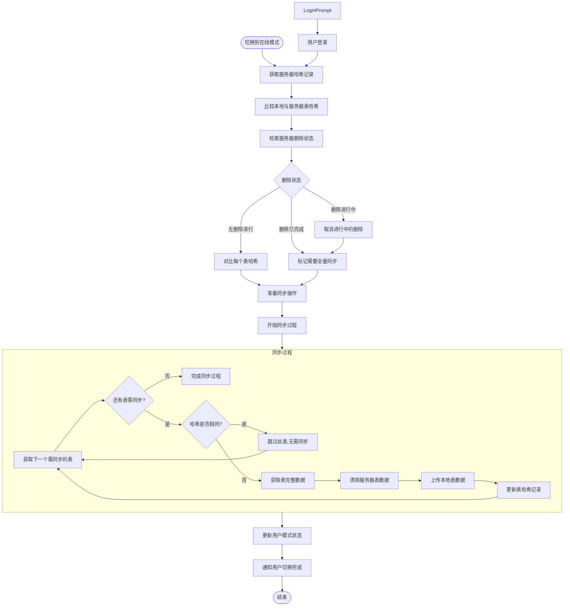

```mermaid
flowchart TD
    Start([切换到在线模式]) --> FetchServerHashes[获取服务器哈希记录]
    
    LoginPrompt --> UserLogin[用户登录]
    UserLogin --> FetchServerHashes
    
    FetchServerHashes --> CompareTables[比较本地与服务器表哈希]
    CompareTables --> CheckDeletionStatus[检查服务器删除状态]
    
    CheckDeletionStatus --> DeletionState{删除状态}
    
    DeletionState -->|无删除进行| CompareHashes[对比每个表哈希]
    DeletionState -->|删除进行中| CancelDeletion[取消进行中的删除]
    DeletionState -->|删除已完成| ForceFullSync[标记需要全量同步]
    
    CancelDeletion --> ForceFullSync
    
    CompareHashes --> PrepareSync[准备同步操作]
    ForceFullSync --> PrepareSync
    
    PrepareSync --> BeginSyncProcess[开始同步过程]
    
    subgraph SyncProcess [同步过程]
        A[获取下一个需同步的表] --> B{还有表需同步?}
        B -->|否| CompleteSyncProcess[完成同步过程]
        B -->|是| C{哈希是否相同?}
        
        C -->|是| TablesSkipped[跳过此表,无需同步]
        C -->|否| D[获取表完整数据]
        TablesSkipped --> A
        
        D --> E[清除服务器表数据]
        E --> F[上传本地表数据]
        F --> G[更新表哈希记录]
        G --> A
    end
    
    BeginSyncProcess --> SyncProcess
    SyncProcess --> UpdateModeState[更新用户模式状态]
    UpdateModeState --> NotifyComplete[通知用户切换完成]
    NotifyComplete --> End([结束])
```