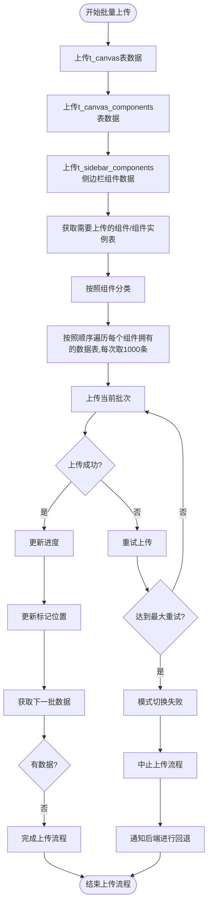

```mermaid
flowchart TD
    Start([开始批量上传]) --> UploadSpaceData[上传t_canvas表数据]
    UploadSpaceData --> UploadComponentListData[上传t_canvas_components表数据]
    UploadComponentListData --> UploadSiderComponent[上传t_sidebar_components侧边栏组件数据]
    UploadSiderComponent --> FetchData[获取需要上传的组件/组件实例表]
    FetchData --> ClassifyData[按照组件分类]
    ClassifyData --> UploadData[按照顺序遍历每个组件拥有的数据表,每次取1000条]
    UploadData --> UploadBatch[上传当前批次]
    
    UpdateProgress --> UpdateMarker[更新标记位置]
    UpdateMarker --> FetchNextBatch[获取下一批数据]
    
    FetchNextBatch --> CheckResults{有数据?}
    CheckResults -->|否| CompleteUpload[完成上传流程]
     
    
    UploadBatch --> UploadSuccess{上传成功?}
    UploadSuccess -->|是| UpdateProgress[更新进度]
    UploadSuccess -->|否| RetryUpload[重试上传]
    
    RetryUpload --> MaxRetries{达到最大重试?}
    MaxRetries -->|否| UploadBatch
    MaxRetries -->|是| ErrorHandling[模式切换失败]
    
    ErrorHandling --> AbortProcess[中止上传流程]
    AbortProcess --> ReportError[通知后端进行回退]
    
    CompleteUpload --> End([结束上传流程])
    ReportError --> End
```