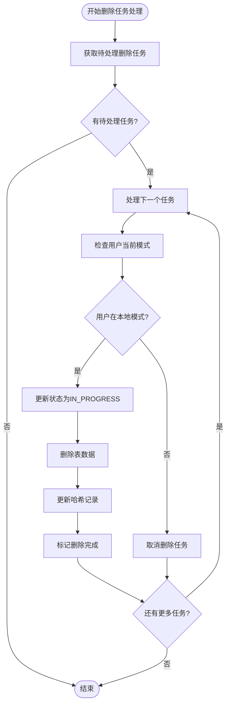

```mermaid
flowchart TD
    Start([开始删除任务处理]) --> FetchPendingTasks[获取待处理删除任务]
    FetchPendingTasks --> TasksExist{有待处理任务?}
    
    TasksExist -->|否| End([结束])
    TasksExist -->|是| ProcessNextTask[处理下一个任务]
    
    ProcessNextTask --> CheckUserMode[检查用户当前模式]
    CheckUserMode --> UserInLocalMode{用户在本地模式?}
    
    UserInLocalMode -->|否| CancelTask[取消删除任务]
    UserInLocalMode -->|是| UpdateTaskStatus[更新状态为IN_PROGRESS]
    
    UpdateTaskStatus --> DeleteTableData[删除表数据]
    DeleteTableData --> UpdateHashRecord[更新哈希记录]
    UpdateHashRecord --> MarkDeletionComplete[标记删除完成]
    
    MarkDeletionComplete --> CheckMoreTasks{还有更多任务?}
    CancelTask --> CheckMoreTasks
    
    CheckMoreTasks -->|是| ProcessNextTask
    CheckMoreTasks -->|否| End
```