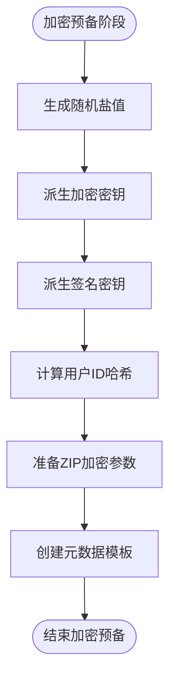

```mermaid
flowchart TD
    Start([加密预备阶段]) --> GenerateSalt[生成随机盐值]
    GenerateSalt --> DeriveEncryptionKey[派生加密密钥]
    
    DeriveEncryptionKey --> CreateSigningKey[派生签名密钥]
    CreateSigningKey --> HashUserID[计算用户ID哈希]
    
    HashUserID --> PrepareZipEncryption[准备ZIP加密参数]
    PrepareZipEncryption --> CreateMetadataTemplate[创建元数据模板]
    
    CreateMetadataTemplate --> End([结束加密预备])
```