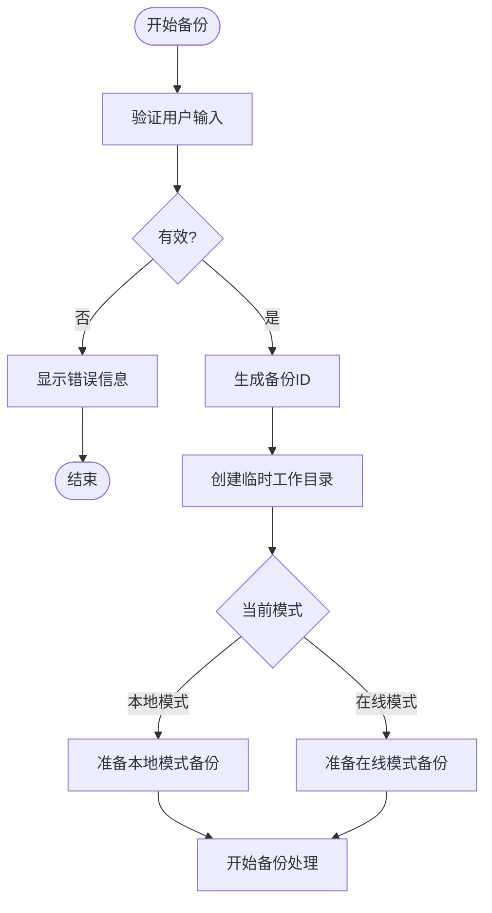

```mermaid
flowchart TD
    Start([开始备份]) --> ValidateInput[验证用户输入]
    ValidateInput --> InputValid{有效?}
    
    InputValid -->|否| ShowError[显示错误信息]
    InputValid -->|是| CreateBackupID[生成备份ID]
    
    ShowError --> End([结束])
    
    CreateBackupID --> CreateWorkDir[创建临时工作目录]
    CreateWorkDir --> CheckMode{当前模式}
    
    CheckMode -->|本地模式| PrepLocalBackup[准备本地模式备份]
    CheckMode -->|在线模式| PrepServerBackup[准备在线模式备份]
    
    PrepLocalBackup --> BeginBackup[开始备份处理]
    PrepServerBackup --> BeginBackup
```