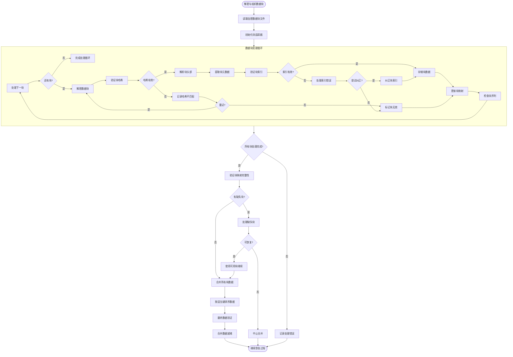

```mermaid
flowchart TD
    Start([解密与组织数据块]) --> ReadEncryptedBlocks[读取加密数据块文件]
    ReadEncryptedBlocks --> InitBlockTracker[初始化块追踪器]
    
    subgraph BlockProcessing [数据块处理循环]
        ProcessNextBlock[处理下一块] --> HasMoreBlocks{还有块?}
        HasMoreBlocks -->|否| CompleteProcessing[完成处理循环]
        HasMoreBlocks -->|是| DecryptBlock[解密数据块]
        
        DecryptBlock --> VerifyBlockHash[验证块哈希]
        VerifyBlockHash --> HashValid{哈希有效?}
        HashValid -->|否| LogHashMismatch[记录哈希不匹配]
        HashValid -->|是| ParseBlockHeader[解析块头部]
        
        ParseBlockHeader --> ExtractBlockMetadata[提取块元数据]
        ExtractBlockMetadata --> ValidateBlockIndex[验证块索引]
        ValidateBlockIndex --> IndexValid{索引有效?}
        
        IndexValid -->|否| HandleIndexError[处理索引错误]
        IndexValid -->|是| StoreBlockData[存储块数据]
        
        StoreBlockData --> UpdateBlockMap[更新块映射]
        UpdateBlockMap --> CheckBlockSequence[检查块序列]
        CheckBlockSequence --> ProcessNextBlock
        
        LogHashMismatch --> RetryDecryption{重试?}
        RetryDecryption -->|是| DecryptBlock
        RetryDecryption -->|否| MarkInvalid[标记块无效]
        
        HandleIndexError --> AttemptCorrection{尝试纠正?}
        AttemptCorrection -->|是| CorrectIndex[纠正块索引]
        AttemptCorrection -->|否| MarkInvalid
        
        CorrectIndex --> StoreBlockData
        MarkInvalid --> UpdateBlockMap
    end
    
    InitBlockTracker --> BlockProcessing
    
    BlockProcessing --> AllBlocksProcessed{所有块处理完成?}
    AllBlocksProcessed -->|是| ValidateBlockMap[验证块映射完整性]
    AllBlocksProcessed -->|否| LogProcessingError[记录处理错误]
    
    ValidateBlockMap --> MissingBlocks{有缺失块?}
    MissingBlocks -->|否| MergeAllBlocks[合并所有块数据]
    MissingBlocks -->|是| HandleMissingBlocks[处理缺失块]
    
    HandleMissingBlocks --> Recoverable{可恢复?}
    Recoverable -->|是| ContinueWithAvailable[使用可用块继续]
    Recoverable -->|否| AbortMerge[中止合并]
    
    ContinueWithAvailable --> MergeAllBlocks
    MergeAllBlocks --> SortMergedData[按适当键排序数据]
    SortMergedData --> FinalValidation[最终数据验证]
    
    FinalValidation --> DataReady[合并数据就绪]
    DataReady --> End([继续恢复过程])
    
    LogProcessingError --> End
    AbortMerge --> End
```