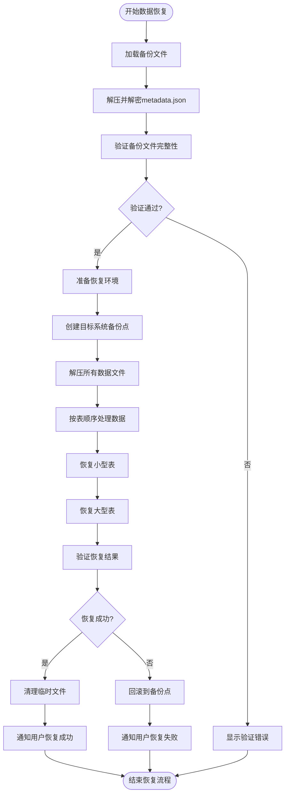

```mermaid
flowchart TD
    Start([开始数据恢复]) --> LoadBackupFile[加载备份文件]
    LoadBackupFile --> ExtractMetadata[解压并解密metadata.json]
    ExtractMetadata --> VerifyBackup[验证备份文件完整性]
    
    VerifyBackup --> BackupValid{验证通过?}
    BackupValid -->|否| ShowValidationError[显示验证错误]
    BackupValid -->|是| PrepareRestoreEnv[准备恢复环境]
    
    PrepareRestoreEnv --> CreateBackupPoint[创建目标系统备份点]
    CreateBackupPoint --> ExtractDataFiles[解压所有数据文件]
    
    ExtractDataFiles --> ProcessTablesSequentially[按表顺序处理数据]
    ProcessTablesSequentially --> RestoreSmallTables[恢复小型表]
    RestoreSmallTables --> RestoreLargeTables[恢复大型表]
    RestoreLargeTables --> VerifyRestoreResult[验证恢复结果]
    
    VerifyRestoreResult --> RestoreSuccess{恢复成功?}
    RestoreSuccess -->|是| CleanupTempFiles[清理临时文件]
    RestoreSuccess -->|否| RollbackToBackupPoint[回滚到备份点]
    
    CleanupTempFiles --> NotifySuccess[通知用户恢复成功]
    RollbackToBackupPoint --> NotifyFailure[通知用户恢复失败]
    
    NotifySuccess --> End([结束恢复流程])
    NotifyFailure --> End
    ShowValidationError --> End
```