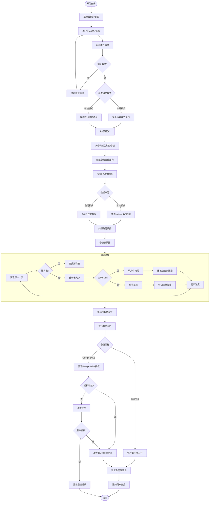

```mermaid
flowchart TD
    Start([开始备份]) --> ShowBackupDialog[显示备份对话框]
    ShowBackupDialog --> UserInput[用户输入备份信息]
    UserInput --> ValidateInput[验证输入信息]
    ValidateInput --> InputValid{输入有效?}
    
    InputValid -->|否| ShowValidationError[显示验证错误]
    ShowValidationError --> UserInput
    
    InputValid -->|是| CheckMode{检查当前模式}
    
    CheckMode -->|本地模式| PrepareLocalBackup[准备本地模式备份]
    CheckMode -->|在线模式| PrepareOnlineBackup[准备在线模式备份]
    
    PrepareLocalBackup --> GenerateBackupID[生成备份ID]
    PrepareOnlineBackup --> GenerateBackupID
    
    GenerateBackupID --> DeriveEncryptionKey[从密码派生加密密钥]
    DeriveEncryptionKey --> CreateBackupStructure[创建备份文件结构]
    CreateBackupStructure --> InitProgressTracker[初始化进度跟踪]
    
    InitProgressTracker --> BackupSource{数据来源}
    
    BackupSource -->|本地模式| QueryIndexedDB[查询IndexedDB数据]
    BackupSource -->|在线模式| FetchFromAPI[从API获取数据]
    
    QueryIndexedDB --> ProcessBackupData[处理备份数据]
    FetchFromAPI --> ProcessBackupData
    
    ProcessBackupData --> BackupTableData[备份表数据]
    
    subgraph DataProcessing [数据处理]
        A[获取下一个表] --> B{还有表?}
        B -->|否| ExitProcessing[完成所有表]
        B -->|是| C[估计表大小]
        
        C --> D{大于5MB?}
        D -->|否| E[单文件处理]
        D -->|是| F[分块处理]
        
        E --> ProcessTable[压缩加密表数据]
        F --> ProcessChunks[分块压缩加密]
        
        ProcessTable --> UpdateProgress[更新进度]
        ProcessChunks --> UpdateProgress
        
        UpdateProgress --> A
    end
    
    BackupTableData --> DataProcessing
    
    DataProcessing --> GenerateMetadata[生成元数据文件]
    GenerateMetadata --> SignMetadata[对元数据签名]
    SignMetadata --> BackupDestination{备份目标}
    
    BackupDestination -->|本地文件| SaveToLocalFile[保存到本地文件]
    BackupDestination -->|Google Drive| AuthenticateGDrive[验证Google Drive授权]
    
    AuthenticateGDrive --> GDriveAuth{授权有效?}
    GDriveAuth -->|否| RequestGDriveAuth[请求授权]
    GDriveAuth -->|是| UploadToGDrive[上传到Google Drive]
    
    RequestGDriveAuth --> UserGrantsAccess{用户授权?}
    UserGrantsAccess -->|是| UploadToGDrive
    UserGrantsAccess -->|否| ShowAuthError[显示授权错误]
    
    SaveToLocalFile --> VerifyBackup[验证备份完整性]
    UploadToGDrive --> VerifyBackup
    
    VerifyBackup --> NotifyCompletion[通知用户完成]
    NotifyCompletion --> End([结束])
    
    ShowAuthError --> End
```