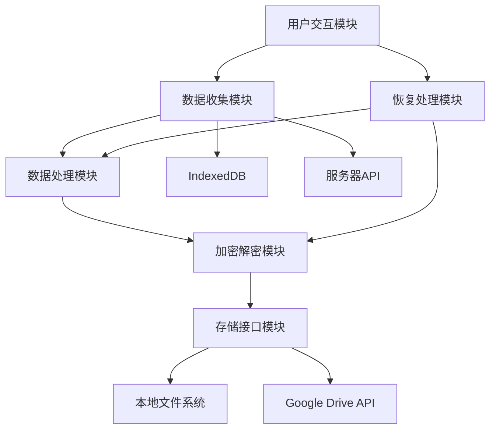

```mermaid
flowchart TD
    UI[用户交互模块] --> DataCollection[数据收集模块]
    DataCollection --> DataProcessing[数据处理模块]
    DataProcessing --> Encryption[加密解密模块]
    Encryption --> Storage[存储接口模块]
    
    UI --> RestoreModule[恢复处理模块]
    RestoreModule --> Encryption
    RestoreModule --> DataProcessing
    
    Storage --> LocalFileSystem[本地文件系统]
    Storage --> GoogleDriveAPI[Google Drive API]
    
    DataCollection --> LocalDB[IndexedDB]
    DataCollection --> ServerAPI[服务器API]
```