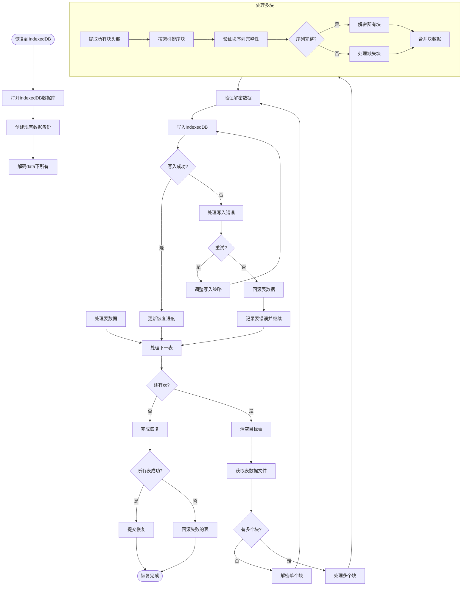

```mermaid
flowchart TD
    Start([恢复到IndexedDB]) --> OpenDB[打开IndexedDB数据库]
    OpenDB --> CreateBackup[创建现有数据备份]
    CreateBackup --> ProcessCanvas[解码data下所有]
    ProcessTables[处理表数据]
    
    ProcessTables --> ProcessNextTable[处理下一表]
    ProcessNextTable --> MoreTables{还有表?}
    MoreTables -->|否| FinalizeRestore[完成恢复]
    MoreTables -->|是| ClearTable[清空目标表]
    
    ClearTable --> GetTableData[获取表数据文件]
    GetTableData --> TableHasMultipleBlocks{有多个块?}
    
    TableHasMultipleBlocks -->|否| DecryptSingleBlock[解密单个块]
    TableHasMultipleBlocks -->|是| ProcessMultipleBlocks[处理多个块]
    
    subgraph MultiBlockProcess [处理多块]
        MB1[提取所有块头部] --> MB2[按索引排序块]
        MB2 --> MB3[验证块序列完整性]
        MB3 --> MB4{序列完整?}
        MB4 -->|否| MB5[处理缺失块]
        MB4 -->|是| MB6[解密所有块]
        MB6 --> MB7[合并块数据]
        MB5 --> MB7
    end
    
    ProcessMultipleBlocks --> MultiBlockProcess
    
    DecryptSingleBlock --> ValidateData[验证解密数据]
    MultiBlockProcess --> ValidateData
    
    ValidateData --> WriteToIndexedDB[写入IndexedDB]
    WriteToIndexedDB --> ValidationSuccess{写入成功?}
    
    ValidationSuccess -->|是| UpdateProgress[更新恢复进度]
    ValidationSuccess -->|否| HandleWriteError[处理写入错误]
    
    HandleWriteError --> RetryWrite{重试?}
    RetryWrite -->|是| AdjustWriteStrategy[调整写入策略]
    RetryWrite -->|否| RollbackTable[回滚表数据]
    
    AdjustWriteStrategy --> WriteToIndexedDB
    RollbackTable --> LogTableError[记录表错误并继续]
    
    UpdateProgress --> ProcessNextTable
    LogTableError --> ProcessNextTable
    
    FinalizeRestore --> AllTablesSuccess{所有表成功?}
    AllTablesSuccess -->|是| CommitRestore[提交恢复]
    AllTablesSuccess -->|否| RollbackFailed[回滚失败的表]
    
    CommitRestore --> End([恢复完成])
    RollbackFailed --> End
```