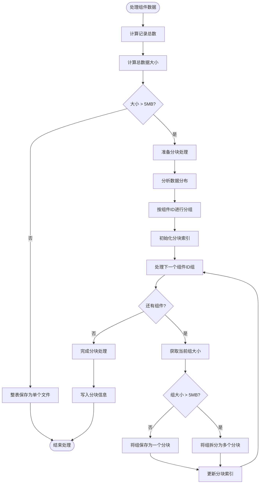

```mermaid
flowchart TD
    Start([处理组件数据]) --> CountRecords[计算记录总数]
    CountRecords --> CalculateSize[计算总数据大小]
    
    CalculateSize --> SizeCheck{大小 > 5MB?}
    SizeCheck -->|否| SaveWhole[整表保存为单个文件]
    SizeCheck -->|是| PrepareChunking[准备分块处理]
    
    SaveWhole --> End([结束处理])
    
    PrepareChunking --> AnalyzeDistribution[分析数据分布]
    AnalyzeDistribution --> GroupByComponent[按组件ID进行分组]
    
    GroupByComponent --> InitChunkIndex[初始化分块索引]
    InitChunkIndex --> ProcessNextGroup[处理下一个组件ID组]
    
    ProcessNextGroup --> HasMoreGroups{还有组件?}
    HasMoreGroups -->|否| FinalizeChunks[完成分块处理]
    HasMoreGroups -->|是| GetGroupSize[获取当前组大小]
    
    GetGroupSize --> GroupSizeCheck{组大小 > 5MB?}
    GroupSizeCheck -->|否| SaveGroup[将组保存为一个分块]
    GroupSizeCheck -->|是| SplitGroup[将组拆分为多个分块]
    
    SaveGroup --> UpdateIndex[更新分块索引]
    SplitGroup --> UpdateIndex
    
    UpdateIndex --> ProcessNextGroup
    
    FinalizeChunks --> WriteChunkInfo[写入分块信息]
    WriteChunkInfo --> End
```