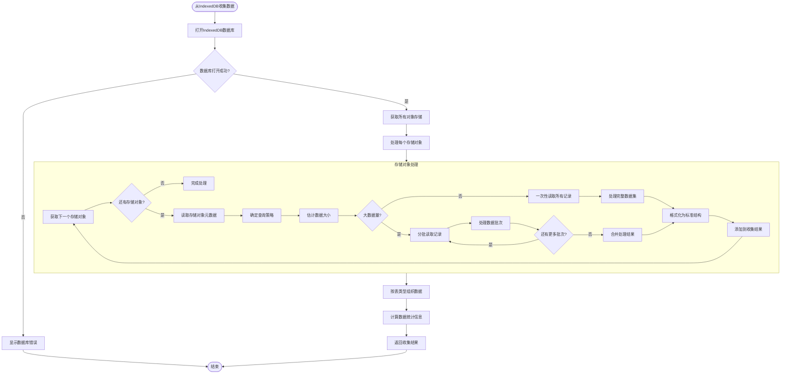

```mermaid
flowchart TD
    Start([从IndexedDB收集数据]) --> OpenDatabase[打开IndexedDB数据库]
    OpenDatabase --> DBOpen{数据库打开成功?}
    
    DBOpen -->|否| ShowDBError[显示数据库错误]
    DBOpen -->|是| GetObjectStores[获取所有对象存储]
    
    ShowDBError --> End([结束])
    
    GetObjectStores --> ProcessStores[处理每个存储对象]
    
    subgraph StoreProcessing [存储对象处理]
        A[获取下一个存储对象] --> B{还有存储对象?}
        B -->|否| ExitLoop[完成处理]
        B -->|是| C[读取存储对象元数据]
        
        C --> D[确定查询策略]
        D --> E[估计数据大小]
        
        E --> F{大数据量?}
        F -->|否| G1[一次性读取所有记录]
        F -->|是| G2[分批读取记录]
        
        G1 --> H1[处理完整数据集]
        G2 --> H2[处理数据批次]
        
        H2 --> I{还有更多批次?}
        I -->|是| G2
        I -->|否| J[合并处理结果]
        
        H1 --> K[格式化为标准结构]
        J --> K
        
        K --> L[添加到收集结果]
        L --> A
    end
    
    ProcessStores --> StoreProcessing
    
    StoreProcessing --> OrganizeByTable[按表类型组织数据]
    OrganizeByTable --> CalculateStats[计算数据统计信息]
    CalculateStats --> ReturnResults[返回收集结果]
    
    ReturnResults --> End
```