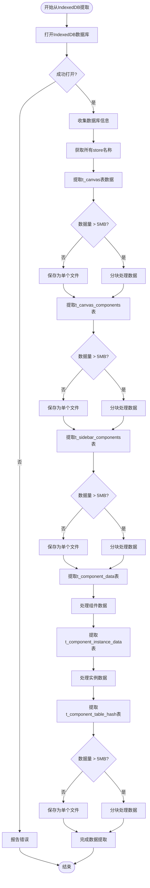

```mermaid
flowchart TD
    Start([开始从IndexedDB提取]) --> OpenDB[打开IndexedDB数据库]
    OpenDB --> OpenResult{成功打开?}
    
    OpenResult -->|否| ReportError[报告错误]
    OpenResult -->|是| CollectDBInfo[收集数据库信息]
    
    ReportError --> End([结束])
    
    CollectDBInfo --> StoreNames[获取所有store名称]
    StoreNames --> ExtractCanvas[提取t_canvas表数据]
    
    ExtractCanvas --> ProcessCanvas{数据量 > 5MB?}
    ProcessCanvas -->|否| SaveSingleFile1[保存为单个文件]
    ProcessCanvas -->|是| ChunkData1[分块处理数据]
    
    SaveSingleFile1 --> ExtractCanvasComp[提取t_canvas_components表]
    ChunkData1 --> ExtractCanvasComp
    
    ExtractCanvasComp --> ProcessCanvasComp{数据量 > 5MB?}
    ProcessCanvasComp -->|否| SaveSingleFile2[保存为单个文件]
    ProcessCanvasComp -->|是| ChunkData2[分块处理数据]
    
    SaveSingleFile2 --> ExtractSidebar[提取t_sidebar_components表]
    ChunkData2 --> ExtractSidebar
    
    ExtractSidebar --> ProcessSidebar{数据量 > 5MB?}
    ProcessSidebar -->|否| SaveSingleFile3[保存为单个文件]
    ProcessSidebar -->|是| ChunkData3[分块处理数据]
    
    SaveSingleFile3 --> ExtractComponentData[提取t_component_data表]
    ChunkData3 --> ExtractComponentData
    
    ExtractComponentData --> ProcessCompData[处理组件数据]
    ProcessCompData --> ExtractInstanceData[提取t_component_instance_data表]
    
    ExtractInstanceData --> ProcessInstanceData[处理实例数据]
    ProcessInstanceData --> ExtractHashTables[提取t_component_table_hash表]
    
    ExtractHashTables --> ProcessHash{数据量 > 5MB?}
    ProcessHash -->|否| SaveSingleFile4[保存为单个文件]
    ProcessHash -->|是| ChunkData4[分块处理数据]
    
    SaveSingleFile4 --> CompleteExtraction[完成数据提取]
    ChunkData4 --> CompleteExtraction
    
    CompleteExtraction --> End
```