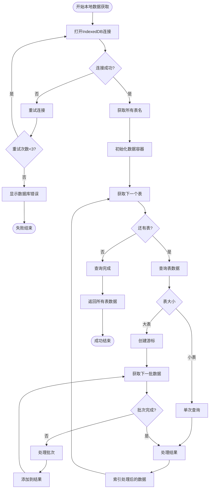

```mermaid
flowchart TD
    Start([开始本地数据获取]) --> OpenIndexedDB[打开IndexedDB连接]
    OpenIndexedDB --> ConnectionOK{连接成功?}
    
    ConnectionOK -->|否| RetryConnection[重试连接]
    RetryConnection --> RetryCount{重试次数<3?}
    RetryCount -->|是| OpenIndexedDB
    RetryCount -->|否| ShowDBError[显示数据库错误]
    ShowDBError --> End([失败结束])
    
    ConnectionOK -->|是| GetStores[获取所有表名]
    GetStores --> InitDataContainers[初始化数据容器]
    
    InitDataContainers --> GetNextTable[获取下一个表]
    GetNextTable --> HasMoreTables{还有表?}
    
    HasMoreTables -->|否| CompleteQuery[查询完成]
    HasMoreTables -->|是| QueryTable[查询表数据]
    
    QueryTable --> TableSize{表大小}
    
    TableSize -->|小表| SingleQuery[单次查询]
    TableSize -->|大表| SetupCursor[创建游标]
    
    SingleQuery --> ProcessResults[处理结果]
    
    SetupCursor --> FetchNextBatch[获取下一批数据]
    FetchNextBatch --> BatchDone{批次完成?}
    BatchDone -->|否| ProcessBatch[处理批次]
    ProcessBatch --> AppendResults[添加到结果]
    AppendResults --> FetchNextBatch
    
    BatchDone -->|是| ProcessResults
    
    ProcessResults --> IndexData[索引处理后的数据]
    IndexData --> GetNextTable
    
    CompleteQuery --> ReturnData[返回所有表数据]
    ReturnData --> EndSuccess([成功结束])
```