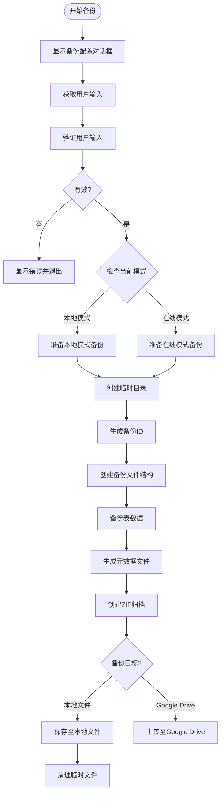

```mermaid
flowchart TD
    Start([开始备份]) --> ShowBackupDialog[显示备份配置对话框]
    ShowBackupDialog --> GetUserInput[获取用户输入]
    GetUserInput --> ValidateInput[验证用户输入]
    
    ValidateInput --> InputValid{有效?}
    InputValid -->|否| ShowError[显示错误并退出]
    InputValid -->|是| CheckMode{检查当前模式}
    
    CheckMode -->|本地模式| PrepareLocalBackup[准备本地模式备份]
    CheckMode -->|在线模式| PrepareOnlineBackup[准备在线模式备份]
    
    PrepareLocalBackup --> CreateTempDir[创建临时目录]
    PrepareOnlineBackup --> CreateTempDir
    
    CreateTempDir --> GenerateBackupID[生成备份ID]
    GenerateBackupID --> CreateBackupStructure[创建备份文件结构]
    
    CreateBackupStructure --> BackupTables[备份表数据]
    BackupTables --> GenerateMetadata[生成元数据文件]
    GenerateMetadata --> CreateZipArchive[创建ZIP归档]
    
    CreateZipArchive --> BackupDestination{备份目标?}
    BackupDestination -->|本地文件| SaveToLocal[保存至本地文件]
    BackupDestination -->|Google Drive| UploadToGDrive[上传至Google Drive]
    
    SaveToLocal --> CleanupTemp[清理临时文件]
```