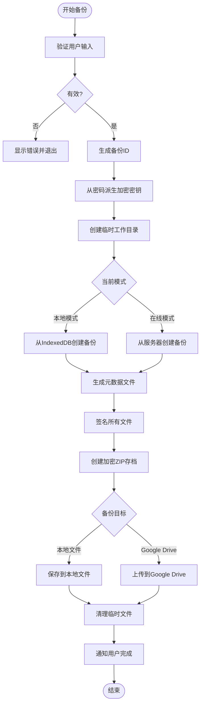

```mermaid
flowchart TD
    Start([开始备份]) --> ValidateInput[验证用户输入]
    ValidateInput --> InputValid{有效?}
    InputValid -->|否| ShowError[显示错误并退出]
    InputValid -->|是| GenerateBackupID[生成备份ID]
    
    GenerateBackupID --> DeriveKey[从密码派生加密密钥]
    DeriveKey --> CreateTemp[创建临时工作目录]
    
    CreateTemp --> CheckMode{当前模式}
    CheckMode -->|本地模式| CreateFromIndexedDB[从IndexedDB创建备份]
    CheckMode -->|在线模式| CreateFromServer[从服务器创建备份]
    
    CreateFromIndexedDB --> GenerateMetadata[生成元数据文件]
    CreateFromServer --> GenerateMetadata
    
    GenerateMetadata --> SignFiles[签名所有文件]
    SignFiles --> CreateZIP[创建加密ZIP存档]
    
    CreateZIP --> BackupDestination{备份目标}
    BackupDestination -->|本地文件| SaveLocal[保存到本地文件]
    BackupDestination -->|Google Drive| UploadGDrive[上传到Google Drive]
    
    SaveLocal --> CleanupTemp[清理临时文件]
    UploadGDrive --> CleanupTemp
    
    CleanupTemp --> NotifyComplete[通知用户完成]
    NotifyComplete --> End([结束])
```