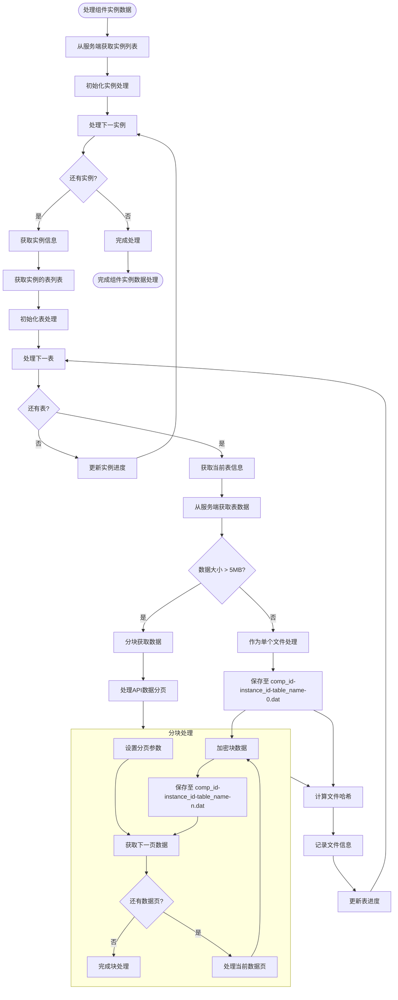

```mermaid
flowchart TD
    Start([处理组件实例数据]) --> FetchInstanceList[从服务端获取实例列表]
    FetchInstanceList --> InitInstanceProcess[初始化实例处理]
    
    InitInstanceProcess --> ProcessNextInst[处理下一实例]
    ProcessNextInst --> MoreInsts{还有实例?}
    MoreInsts -->|否| CompleteProcess[完成处理]
    MoreInsts -->|是| GetInstanceInfo[获取实例信息]
    
    GetInstanceInfo --> FetchTableList[获取实例的表列表]
    FetchTableList --> InitTableProcess[初始化表处理]
    
    InitTableProcess --> ProcessNextTable[处理下一表]
    ProcessNextTable --> MoreTables{还有表?}
    MoreTables -->|否| UpdateInstProgress[更新实例进度]
    MoreTables -->|是| GetTableInfo[获取当前表信息]
    
    UpdateInstProgress --> ProcessNextInst
    
    GetTableInfo --> FetchTableData[从服务端获取表数据]
    FetchTableData --> DataSize{数据大小 > 5MB?}
    
    DataSize -->|否| SingleFile[作为单个文件处理]
    DataSize -->|是| ChunkedFetch[分块获取数据]
    
    SingleFile --> SaveInstData[保存至 comp_id-instance_id-table_name-0.dat]
    ChunkedFetch --> ProcessAPIChunks[处理API数据分页]
    
    subgraph ChunkProcess [分块处理]
        C1[设置分页参数] --> C2[获取下一页数据]
        C2 --> C3{还有数据页?}
        C3 -->|否| C7[完成块处理]
        C3 -->|是| C4[处理当前数据页]
        C4 --> C5[加密块数据]
        C5 --> C6[保存至 comp_id-instance_id-table_name-n.dat]
        C6 --> C2
    end
    
    ProcessAPIChunks --> ChunkProcess
    
    SaveInstData --> C5
    SaveInstData --> CalcFileHash[计算文件哈希]
    ChunkProcess --> CalcFileHash
    
    CalcFileHash --> RecordFileInfo[记录文件信息]
    RecordFileInfo --> UpdateTableProgress[更新表进度]
    UpdateTableProgress --> ProcessNextTable
    
    CompleteProcess --> End([完成组件实例数据处理])
```