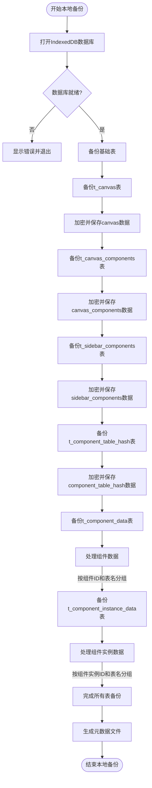

```mermaid
flowchart TD
    Start([开始本地备份]) --> OpenDB[打开IndexedDB数据库]
    OpenDB --> DBReady{数据库就绪?}
    DBReady -->|否| ShowDBError[显示错误并退出]
    DBReady -->|是| BackupBasicTables[备份基础表]
    
    BackupBasicTables --> BackupCanvas[备份t_canvas表]
    BackupCanvas --> EncryptCanvas[加密并保存canvas数据]
    
    EncryptCanvas --> BackupCanvasComps[备份t_canvas_components表]
    BackupCanvasComps --> EncryptCanvasComps[加密并保存canvas_components数据]
    
    EncryptCanvasComps --> BackupSidebarComps[备份t_sidebar_components表]
    BackupSidebarComps --> EncryptSidebarComps[加密并保存sidebar_components数据]
    
    EncryptSidebarComps --> BackupComponentHash[备份t_component_table_hash表]
    BackupComponentHash --> EncryptComponentHash[加密并保存component_table_hash数据]
    
    EncryptComponentHash --> BackupComponentData[备份t_component_data表]
    BackupComponentData --> ProcessCompData[处理组件数据]
    
    ProcessCompData -->|按组件ID和表名分组| BackupComponentInstData[备份t_component_instance_data表]
    BackupComponentInstData --> ProcessInstData[处理组件实例数据]
    
    ProcessInstData -->|按组件实例ID和表名分组| CompleteBackup[完成所有表备份]
    CompleteBackup --> GenerateMetadata[生成元数据文件]
    
    GenerateMetadata --> End([结束本地备份])
```