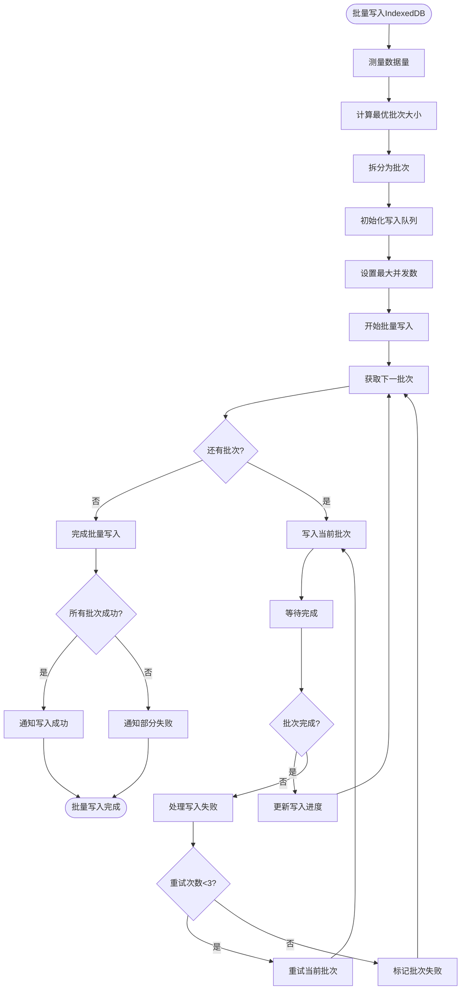

```mermaid
flowchart TD
    Start([批量写入IndexedDB]) --> MeasureData[测量数据量]
    MeasureData --> CalcOptimalBatch[计算最优批次大小]
    
    CalcOptimalBatch --> SplitIntoBatches[拆分为批次]
    SplitIntoBatches --> InitWriteQueue[初始化写入队列]
    
    InitWriteQueue --> SetConcurrency[设置最大并发数]
    SetConcurrency --> BeginBatchWrite[开始批量写入]
    
    BeginBatchWrite --> GetNextBatch[获取下一批次]
    GetNextBatch --> MoreBatches{还有批次?}
    
    MoreBatches -->|否| FinalizeBatchWrite[完成批量写入]
    MoreBatches -->|是| WriteCurrentBatch[写入当前批次]
    
    WriteCurrentBatch --> WaitForCompletion[等待完成]
    WaitForCompletion --> BatchComplete{批次完成?}
    
    BatchComplete -->|是| UpdateWriteProgress[更新写入进度]
    BatchComplete -->|否| HandleWriteFailure[处理写入失败]
    
    HandleWriteFailure --> RetryCount{重试次数<3?}
    RetryCount -->|是| RetryBatch[重试当前批次]
    RetryCount -->|否| MarkBatchFailed[标记批次失败]
    
    RetryBatch --> WriteCurrentBatch
    UpdateWriteProgress --> GetNextBatch
    MarkBatchFailed --> GetNextBatch
    
    FinalizeBatchWrite --> CheckAllSuccess{所有批次成功?}
    CheckAllSuccess -->|是| NotifySuccess[通知写入成功]
    CheckAllSuccess -->|否| NotifyPartialFailure[通知部分失败]
    
    NotifySuccess --> End([批量写入完成])
    NotifyPartialFailure --> End
```