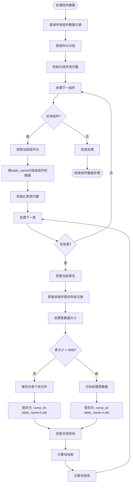

```mermaid
flowchart TD
    Start([处理组件数据]) --> QueryAll[查询所有组件数据记录]
    QueryAll --> GroupByComp[按组件ID分组]
    GroupByComp --> InitCompIterator[初始化组件迭代器]
    
    InitCompIterator --> NextComp[处理下一组件]
    NextComp --> HasMoreComp{还有组件?}
    HasMoreComp -->|否| CompleteProcess[完成处理]
    HasMoreComp -->|是| GetCompID[获取当前组件ID]
    
    GetCompID --> GroupByTable[按table_name分组该组件的数据]
    GroupByTable --> InitTableIterator[初始化表迭代器]
    
    InitTableIterator --> NextTable[处理下一表]
    NextTable --> HasMoreTables{还有表?}
    HasMoreTables -->|否| NextComp
    HasMoreTables -->|是| GetTableName[获取当前表名]
    
    GetTableName --> GetTableRecords[获取该组件表的所有记录]
    GetTableRecords --> EstimateTableSize[估算表数据大小]
    
    EstimateTableSize --> SizeCheck{表大小 > 5MB?}
    SizeCheck -->|否| SaveAsOneChunk[保存为单个块文件]
    SizeCheck -->|是| ChunkTable[分块处理表数据]
    
    SaveAsOneChunk --> SavePath[保存为: comp_id-table_name-0.dat]
    ChunkTable --> ChunkPath[保存为: comp_id-table_name-n.dat]
    
    SavePath --> EncryptChunk[加密并保存块]
    ChunkPath --> EncryptChunk
    
    EncryptChunk --> CalcChunkHash[计算块哈希]
    CalcChunkHash --> RecordChunkInfo[记录块信息]
    RecordChunkInfo --> NextTable
    
    CompleteProcess --> End([结束组件数据处理])
```