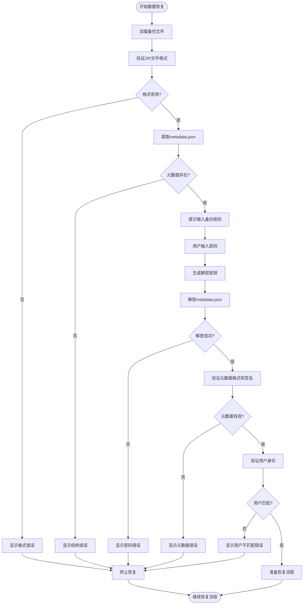

```mermaid
flowchart TD
    Start([开始数据恢复]) --> LoadBackupFile[加载备份文件]
    LoadBackupFile --> ValidateZipFormat[验证ZIP文件格式]
    
    ValidateZipFormat --> FormatValid{格式有效?}
    FormatValid -->|否| ShowFormatError[显示格式错误]
    FormatValid -->|是| ExtractMetadata[提取metadata.json]
    
    ExtractMetadata --> MetadataExists{元数据存在?}
    MetadataExists -->|否| ShowStructureError[显示结构错误]
    MetadataExists -->|是| PromptPassword[提示输入备份密码]
    
    PromptPassword --> UserInputsPassword[用户输入密码]
    UserInputsPassword --> GenerateDecryptionKey[生成解密密钥]
    GenerateDecryptionKey --> DecryptMetadata[解密metadata.json]
    
    DecryptMetadata --> DecryptSuccess{解密成功?}
    DecryptSuccess -->|否| ShowPasswordError[显示密码错误]
    DecryptSuccess -->|是| ValidateMetadata[验证元数据格式和签名]
    
    ValidateMetadata --> MetadataValid{元数据有效?}
    MetadataValid -->|否| ShowMetadataError[显示元数据错误]
    MetadataValid -->|是| VerifyUserIdentity[验证用户身份]
    
    VerifyUserIdentity --> UserIdentityValid{用户匹配?}
    UserIdentityValid -->|否| ShowUserError[显示用户不匹配错误]
    UserIdentityValid -->|是| PrepareRestoreProcess[准备恢复流程]
    
    PrepareRestoreProcess --> End([继续恢复流程])
    
    ShowFormatError --> AbortRestore[终止恢复]
    ShowStructureError --> AbortRestore
    ShowPasswordError --> AbortRestore
    ShowMetadataError --> AbortRestore
    ShowUserError --> AbortRestore
    
    AbortRestore --> End
```