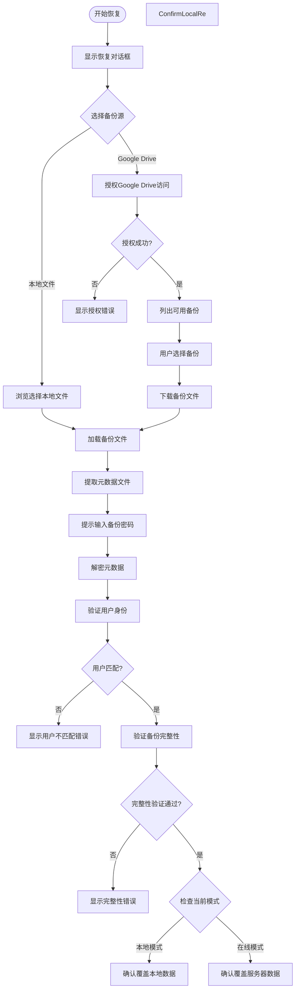

```mermaid
flowchart TD
    Start([开始恢复]) --> ShowRestoreDialog[显示恢复对话框]
    ShowRestoreDialog --> SelectSource{选择备份源}
    
    SelectSource -->|本地文件| BrowseLocal[浏览选择本地文件]
    SelectSource -->|Google Drive| AuthGDrive[授权Google Drive访问]
    
    BrowseLocal --> LoadBackupFile[加载备份文件]
    
    AuthGDrive --> AuthSuccess{授权成功?}
    AuthSuccess -->|否| ShowAuthError[显示授权错误]
    AuthSuccess -->|是| ListGDriveBackups[列出可用备份]
    
    ListGDriveBackups --> SelectBackup[用户选择备份]
    SelectBackup --> DownloadBackup[下载备份文件]
    DownloadBackup --> LoadBackupFile
    
    LoadBackupFile --> ExtractMetadata[提取元数据文件]
    ExtractMetadata --> PromptPassword[提示输入备份密码]
    PromptPassword --> DecryptMetadata[解密元数据]
    
    DecryptMetadata --> ValidateUser[验证用户身份]
    ValidateUser --> UserValid{用户匹配?}
    
    UserValid -->|否| ShowUserError[显示用户不匹配错误]
    UserValid -->|是| VerifyIntegrity[验证备份完整性]
    
    VerifyIntegrity --> IntegrityValid{完整性验证通过?}
    IntegrityValid -->|否| ShowIntegrityError[显示完整性错误]
    IntegrityValid -->|是| CheckCurrentMode{检查当前模式}
    
    CheckCurrentMode -->|本地模式| ConfirmLocalRestore[确认覆盖本地数据]
    CheckCurrentMode -->|在线模式| ConfirmServerRestore[确认覆盖服务器数据]
    
    ConfirmLocalRe
```