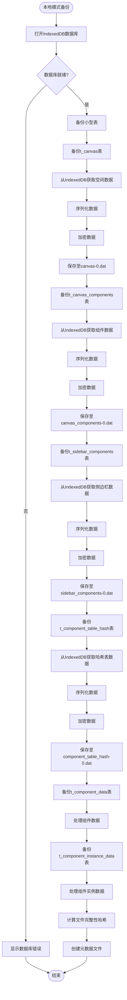

```mermaid
flowchart TD
    Start([本地模式备份]) --> OpenDB[打开IndexedDB数据库]
    OpenDB --> DBReady{数据库就绪?}
    
    DBReady -->|否| ShowDBError[显示数据库错误]
    DBReady -->|是| BackupSmallTables[备份小型表]
    
    ShowDBError --> End([结束])
    
    BackupSmallTables --> BackupCanvas[备份t_canvas表]
    BackupCanvas --> GetCanvasFromDB[从IndexedDB获取空间数据]
    GetCanvasFromDB --> SerializeCanvas[序列化数据]
    SerializeCanvas --> EncryptCanvas[加密数据]
    EncryptCanvas --> SaveCanvasFile[保存至canvas-0.dat]
    
    SaveCanvasFile --> BackupCanvasComps[备份t_canvas_components表]
    BackupCanvasComps --> GetCanvasCompsFromDB[从IndexedDB获取组件数据]
    GetCanvasCompsFromDB --> SerializeCanvasComps[序列化数据]
    SerializeCanvasComps --> EncryptCanvasComps[加密数据]
    EncryptCanvasComps --> SaveCanvasCompsFile[保存至canvas_components-0.dat]
    
    SaveCanvasCompsFile --> BackupSidebarComps[备份t_sidebar_components表]
    BackupSidebarComps --> GetSidebarCompsFromDB[从IndexedDB获取侧边栏数据]
    GetSidebarCompsFromDB --> SerializeSidebarComps[序列化数据]
    SerializeSidebarComps --> EncryptSidebarComps[加密数据]
    EncryptSidebarComps --> SaveSidebarCompsFile[保存至sidebar_components-0.dat]
    
    SaveSidebarCompsFile --> BackupHashTables[备份t_component_table_hash表]
    BackupHashTables --> GetHashTablesFromDB[从IndexedDB获取哈希表数据]
    GetHashTablesFromDB --> SerializeHashTables[序列化数据]
    SerializeHashTables --> EncryptHashTables[加密数据]
    EncryptHashTables --> SaveHashTablesFile[保存至component_table_hash-0.dat]
    
    SaveHashTablesFile --> BackupCompData[备份t_component_data表]
    BackupCompData --> ProcessCompData[处理组件数据]
    
    ProcessCompData --> BackupInstData[备份t_component_instance_data表]
    BackupInstData --> ProcessInstData[处理组件实例数据]
    
    ProcessInstData --> CalculateIntegrity[计算文件完整性哈希]
    CalculateIntegrity --> CreateMetadataFile[创建元数据文件]
    
    CreateMetadataFile --> End
```