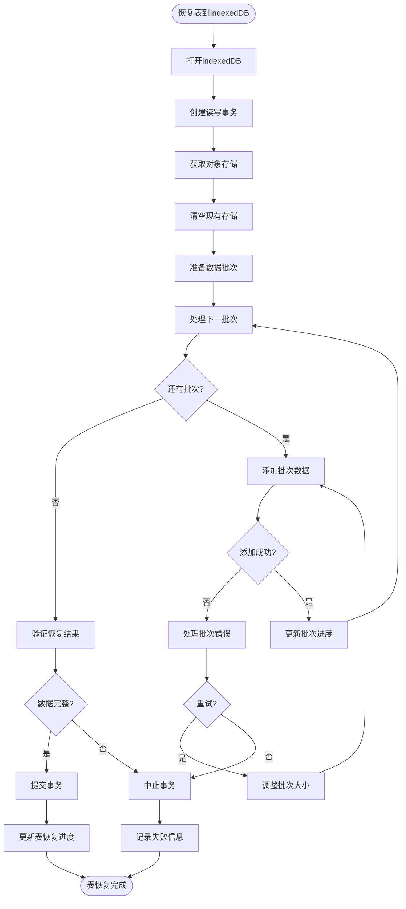

```mermaid
flowchart TD
    Start([恢复表到IndexedDB]) --> OpenDB[打开IndexedDB]
    OpenDB --> CreateTx[创建读写事务]
    CreateTx --> GetStore[获取对象存储]
    
    GetStore --> ClearStore[清空现有存储]
    ClearStore --> PrepareBatches[准备数据批次]
    
    PrepareBatches --> ProcessNextBatch[处理下一批次]
    ProcessNextBatch --> MoreBatches{还有批次?}
    
    MoreBatches -->|否| VerifyResults[验证恢复结果]
    MoreBatches -->|是| AddBatch[添加批次数据]
    
    AddBatch --> BatchAdded{添加成功?}
    BatchAdded -->|否| HandleBatchError[处理批次错误]
    BatchAdded -->|是| UpdateBatchProgress[更新批次进度]
    
    HandleBatchError --> RetryBatch{重试?}
    RetryBatch -->|是| AdjustBatchSize[调整批次大小]
    RetryBatch -->|否| AbortTx[中止事务]
    
    AdjustBatchSize --> AddBatch
    UpdateBatchProgress --> ProcessNextBatch
    
    VerifyResults --> DataComplete{数据完整?}
    DataComplete -->|是| CommitTx[提交事务]
    DataComplete -->|否| AbortTx
    
    CommitTx --> UpdateTableProgress[更新表恢复进度]
    AbortTx --> LogFailure[记录失败信息]
    
    UpdateTableProgress --> End([表恢复完成])
    LogFailure --> End
```