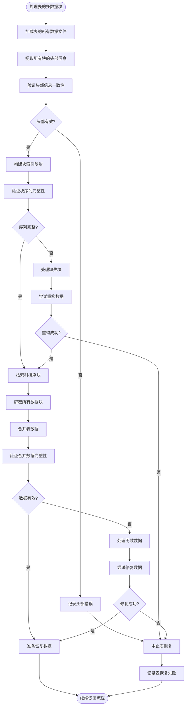

```mermaid
flowchart TD
    Start([处理表的多数据块]) --> LoadFilesForTable[加载表的所有数据文件]
    LoadFilesForTable --> ExtractHeaders[提取所有块的头部信息]
    
    ExtractHeaders --> ValidateHeaders[验证头部信息一致性]
    ValidateHeaders --> HeadersValid{头部有效?}
    
    HeadersValid -->|否| LogHeaderError[记录头部错误]
    HeadersValid -->|是| BuildBlocksMap[构建块索引映射]
    
    BuildBlocksMap --> VerifyBlocksSequence[验证块序列完整性]
    VerifyBlocksSequence --> SequenceComplete{序列完整?}
    
    SequenceComplete -->|否| HandleMissingBlocks[处理缺失块]
    SequenceComplete -->|是| SortBlocksByIndex[按索引排序块]
    
    SortBlocksByIndex --> DecryptBlocks[解密所有数据块]
    DecryptBlocks --> MergeTableData[合并表数据]
    
    MergeTableData --> ValidateMergedData[验证合并数据完整性]
    ValidateMergedData --> DataValid{数据有效?}
    
    DataValid -->|否| HandleInvalidData[处理无效数据]
    DataValid -->|是| PrepareForRestore[准备恢复数据]
    
    PrepareForRestore --> End([继续恢复流程])
    
    LogHeaderError --> AbortTableRestore[中止表恢复]
    HandleMissingBlocks --> AttemptReconstruction[尝试重构数据]
    AttemptReconstruction --> ReconstructionSuccess{重构成功?}
    
    ReconstructionSuccess -->|是| SortBlocksByIndex
    ReconstructionSuccess -->|否| AbortTableRestore
    
    HandleInvalidData --> AttemptRepair[尝试修复数据]
    AttemptRepair --> RepairSuccess{修复成功?}
    
    RepairSuccess -->|是| PrepareForRestore
    RepairSuccess -->|否| AbortTableRestore
    
    AbortTableRestore --> NotifyTableError[记录表恢复失败]
    NotifyTableError --> End
```