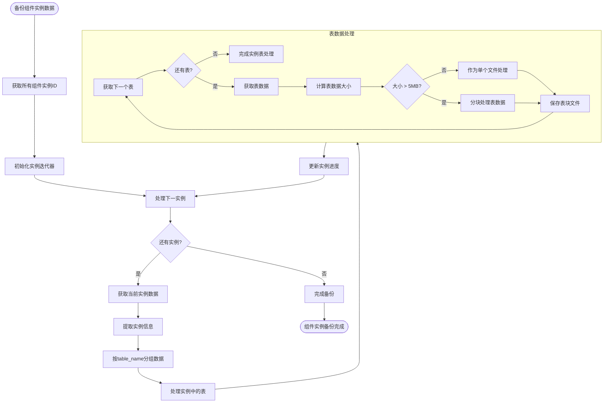

```mermaid
flowchart TD
    Start([备份组件实例数据]) --> FetchAllInstanceIDs[获取所有组件实例ID]
    FetchAllInstanceIDs --> InitInstanceIterator[初始化实例迭代器]
    
    InitInstanceIterator --> ProcessNextInstance[处理下一实例]
    ProcessNextInstance --> MoreInstances{还有实例?}
    MoreInstances -->|否| CompleteBackup[完成备份]
    MoreInstances -->|是| GetInstanceData[获取当前实例数据]
    
    GetInstanceData --> ExtractInstanceInfo[提取实例信息]
    ExtractInstanceInfo --> GroupByTable[按table_name分组数据]
    
    GroupByTable --> ProcessTables[处理实例中的表]
    
    subgraph TableProcessing [表数据处理]
        PT1[获取下一个表] --> PT2{还有表?}
        PT2 -->|否| PT9[完成实例表处理]
        PT2 -->|是| PT3[获取表数据]
        
        PT3 --> PT4[计算表数据大小]
        PT4 --> PT5{大小 > 5MB?}
        PT5 -->|否| PT6[作为单个文件处理]
        PT5 -->|是| PT7[分块处理表数据]
        
        PT6 --> PT8[保存表块文件]
        PT7 --> PT8
        
        PT8 --> PT1
    end
    
    ProcessTables --> TableProcessing
    
    TableProcessing --> UpdateInstanceProgress[更新实例进度]
    UpdateInstanceProgress --> ProcessNextInstance
    
    CompleteBackup --> End([组件实例备份完成])
```