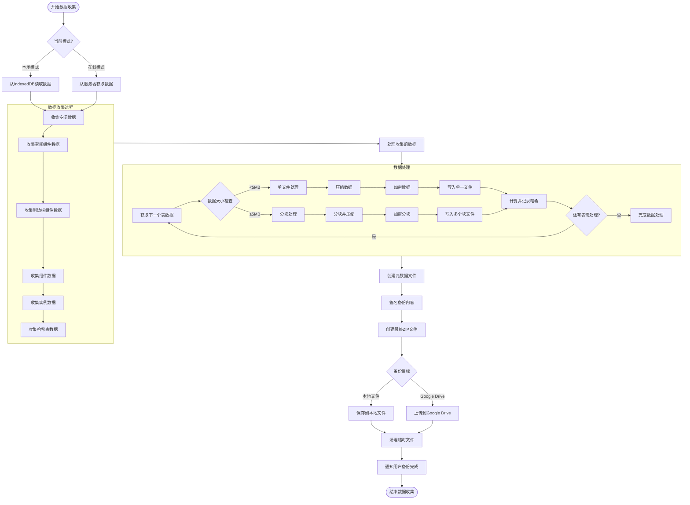

```mermaid
flowchart TD
    Start([开始数据收集]) --> CheckMode{当前模式?}
    
    CheckMode -->|本地模式| ReadFromIndexedDB[从IndexedDB读取数据]
    CheckMode -->|在线模式| FetchFromServer[从服务器获取数据]
    
    ReadFromIndexedDB --> CollectCanvas[收集空间数据]
    FetchFromServer --> CollectCanvas
    
    subgraph DataCollection [数据收集过程]
        CollectCanvas[收集空间数据] --> CollectCanvasComp[收集空间组件数据]
        CollectCanvasComp --> CollectSidebarComp[收集侧边栏组件数据]
        CollectSidebarComp --> CollectCompData[收集组件数据]
        CollectCompData --> CollectInstanceData[收集实例数据]
        CollectInstanceData --> CollectHashTables[收集哈希表数据]
    end
    
    DataCollection --> ProcessCollectedData[处理收集的数据]
    
    subgraph DataProcessing [数据处理]
        A[获取下一个表数据] --> B{数据大小检查}
        B -->|<5MB| C1[单文件处理]
        B -->|≥5MB| C2[分块处理]
        
        C1 --> D1[压缩数据]
        C2 --> D2[分块并压缩]
        
        D1 --> E1[加密数据]
        D2 --> E2[加密分块]
        
        E1 --> F1[写入单一文件]
        E2 --> F2[写入多个块文件]
        
        F1 --> G[计算并记录哈希]
        F2 --> G
        
        G --> H{还有表需处理?}
        H -->|是| A
        H -->|否| I[完成数据处理]
    end
    
    ProcessCollectedData --> DataProcessing
    
    DataProcessing --> CreateMetadataFile[创建元数据文件]
    CreateMetadataFile --> SignBackupContent[签名备份内容]
    SignBackupContent --> CreateFinalZip[创建最终ZIP文件]
    
    CreateFinalZip --> DestinationType{备份目标}
    DestinationType -->|本地文件| SaveToLocalFile[保存到本地文件]
    DestinationType -->|Google Drive| UploadToGDrive[上传到Google Drive]
    
    SaveToLocalFile --> CleanupTemp[清理临时文件]
    UploadToGDrive --> CleanupTemp
    
    CleanupTemp --> NotifyUser[通知用户备份完成]
    NotifyUser --> End([结束数据收集])
```